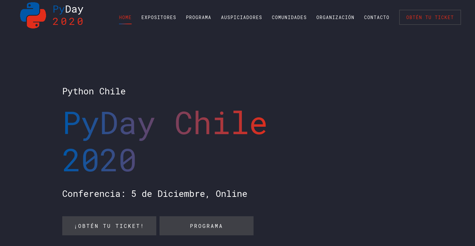
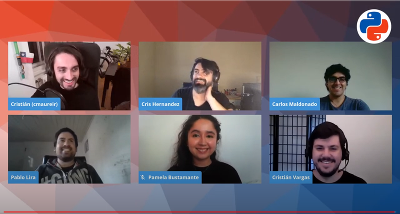

Cuando el grupo **Python Chile** retomó su funcionamiento con nuevos miembros,
después de años de inactividad, decidimos que el siguiente paso era **organizar
un evento juntos**. A pesar de que teníamos un poco de experiencia participando
en conferencias, la organización de una conferencia de cero se vislumbra como
una tarea compleja, e inicialmente nos causó un poco de nerviosismo, ya que
dudamos del impacto que tendría en la comunidad en un grupo de personas de
Chile. Así comenzó el [PyDay Chile 2020](https://pyday.cl).

No estábamos seguros cuantas postulaciones tendríamos, así que el **plan B** era
definir algunas charlas entre los organizadores para al menos tener un evento
de un par de horas. Adicionalmente, queríamos hacer algo que motivara a muchas
más personas a postular, con lo que nos inspiramos en la dinámica de la
conferencia [Python Pizza](https://python.pizza/), donde solo se realizan charlas de 10 minutos (que
aumentamos a **15 minutos** para no ser extremos), **sin preguntas en vivo**
y potenciando la interacción en persona comiendo Pizza; estando en medio de una
pandemia, y sin pizza, no nos quedó otra de buscar ideas para la **interacción de
las personas durante el evento**, con lo que gracias a estructura de eventos
pasados como el [HacktoberfestES](https://hacktoberfest.es.python.org/) y la [PyConAr](https://eventos.python.org.ar/events/pyconar2020/), optamos por utilizar [Discord](https://discord.gg/dTHMfJvauS) para
crear canales y que la gente pudiera hablar durante el evento,
y [StreamYard](https://streamyard.com/)
para la transmisión.

## El equipo organizador

Las organizaciones de grandes conferencias por lo general tienen **equipos de
trabajos** encargados de distintas temáticas, pero acá **éramos sólo
6 personas** cursando estudios, trabajando en distintas zonas horarias, y con
distintas responsabilidades que nos iban a impedir acordar un horario tan
fácilmente; afortunadamente, logramos agendar una reunión semanal, donde al
menos podríamos ir discutiendo los siguientes pasos.

Un pequeño detalle es que **recién nos estábamos conociendo**, no sabíamos
nuestros modos de trabajo, de lo que queríamos encargarnos, y tampoco que tan
responsables seríamos con esta idea tan loca; sin considerar que no teníamos
credenciales para que los asistentes confiaran en nosotros como comité
organizador, ya que incluso Python Chile era un concepto "nuevo" para muchos.

## Antes del evento

Una de las motivaciones que teníamos era poder reunir fondos para formalizar
una **Corporación para Python Chile** y así poder transparentar todos los
gastos que habíamos estado teniendo, como hosting, dominios, todo lo que
podríamos hacer en el futuro como merchandising, o el pago de servicios
externos para potenciar otros eventos, así que abrimos la posibilidad a que
empresas pudieran auspiciarnos, de cuál no estábamos seguro que tendríamos
alguna llegada, ni que estuvieran dispuestas a apoyar esta nueva iniciativa.

Mientras tanto, habían llegado solo un par de charlas en la primera semana, con
lo que el plan B de improvisar charlas se estaba haciendo una realidad, con lo
que decidimos poder acercarnos a establecimientos educacionales, y comunidades
amigas donde podríamos conocer gente interesada, para la difusión del evento.
En el momento que comenzamos a compartir por redes sociales el evento,
**comenzó a llegar mucha gente a seguirnos, y preguntar sobre el evento**, a lo
que comenzaron a aumentar la cantidad de charlas postuladas, por supuesto, sin
dejar de lado que comenzamos a motivar a todos nuestros conocidos para que
participaran en el evento.

Quedando menos de un mes, nos dimos cuenta que podríamos tener un par de
**Keynotes**, pero de nuevo el miedo de "acabamos de reactivar esta comunidad,
puedes hacer una de las charlas principales?" y que nos dijeran "eh...nop" era
bastante grande, pero afortunadamente tuvimos la suerte de que [Katia
Lira](https://twitter.com/lakatialira), [Lorena
Mesa](https://twitter.com/loooorenanicole) y [Juan Luis Cano
Rodriguez](https://twitter.com/poliastro_py) confiaran en nuestra propuesta.

Sabíamos que una conferencia con charlas solo **en vivo** podía ser peligroso,
pero también que a muchas personas no les gustaría un evento completamente
**grabado**, así que decidimos realizar una **mezcla**, acompañada de la
presencia de un par de Hosts para el evento, y con el dinamismo de una
discusión durante el día en Discord...y **¡funcionó!**

## Resultados y números

En una de las primeras reuniones de la organización del evento, debatimos la
posibilidad de tener 100 o 200 personas, y lo veíamos casi imposible, sin
considerar que siempre en eventos gratuitos participa entre el 10 y 30% (por
nuestra experiencia); de la misma manera estábamos casi seguros que un par de
empresas podrían decidir apoyarnos. Todo esto bajo la idea de un evento de
quizás unas 3-4 horas. Afortunadamente estábamos muy equivocados.

Respecto al **apoyo al evento**, conseguimos:

 * Auspiciadores: https://pyday.cl/#sponsors
   * 8 Gold, 2 Silver, y 2 Copper,
 * 4 establecimientos educacionales, y
 * 10 comunidades https://pyday.cl/#communities

Con **más de 60 postulaciones de charlas**, teníamos material para hacer una
conferencia de 3 o 4 días, pero como habíamos tomado la decisión de tener un
PyDay, tuvimos la difícil tarea de no aceptar muchas charlas de calidad, solo
por un tema de límite horario, y **de las 10 charlas iniciales decidimos hacer
25** ([Mira el programa acá](https://pyday.cl/#schedule)), lo que nos llevó al
siguiente resultado:

 * Distribuimos un total de 2340 tickets por Eventbrite,
 * 704 personas se unieron a Discord (un 30.1% del total),
 * Tuvimos 3.8K vistas en YouTube (con 1.7K espectadores únicos),
 * El canal de YouTube pasó de 1 a 404 suscripciones,
 * Las personas vieron un total de 2.9K horas de transmisión.
 * 5.3K visitas al sitio de PyDay en los últimos 60 días

Todo esto en más de **11 horas de transmisión**.

## Palabras finales

Sin lugar a duda, el **PyDay Chile 2020 fue todo un éxito**, pero somos
conscientes que tenemos que aumentar la cantidad de gente detrás de Python
Chile para poder realizar más eventos y con un impacto aún mayor. Queremos
invitarlos a ser parte del equipo, y ayudarnos a que la comunidad siga
creciendo, pero sobre todo, mejorando. **Puedes postular en éste enlace:**
http://pythonchile.cl/voluntariado

La comunidad de Python se ha caracterizado por ser una de las más amigables
e inclusivas dentro del mundo tecnológico, lo que pudimos confirmar en este
lejano rincón del mundo, con nuestro primer evento nacional.

La cantidad de horas invertidas en la organización del evento fue recompensada
con el reforzamiento de una comunidad un poco dormida, y sobre todo de la
confianza y cariño de todas las personas que pudieron participar con nosotros,
en el pasado **5 de Diciembre del 2020**.

De parte de todo el equipo organizador ¡Muchas Gracias!

**Equipo:**

 * Pamela Bustamante
 * Cris Hernández
 * Pablo Lira
 * Cristián Vargas
 * Carlos Maldonado
 * Cristián Maureira-Fredes

