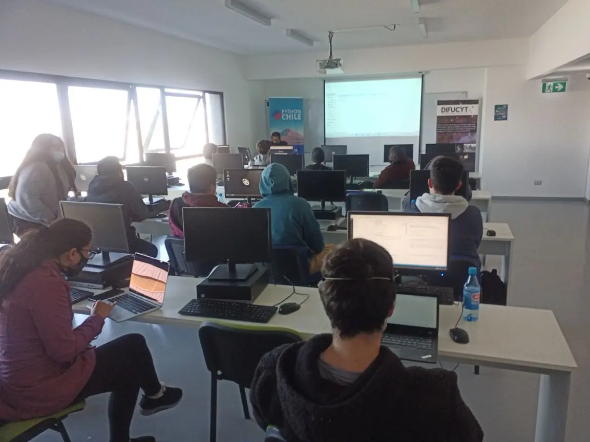
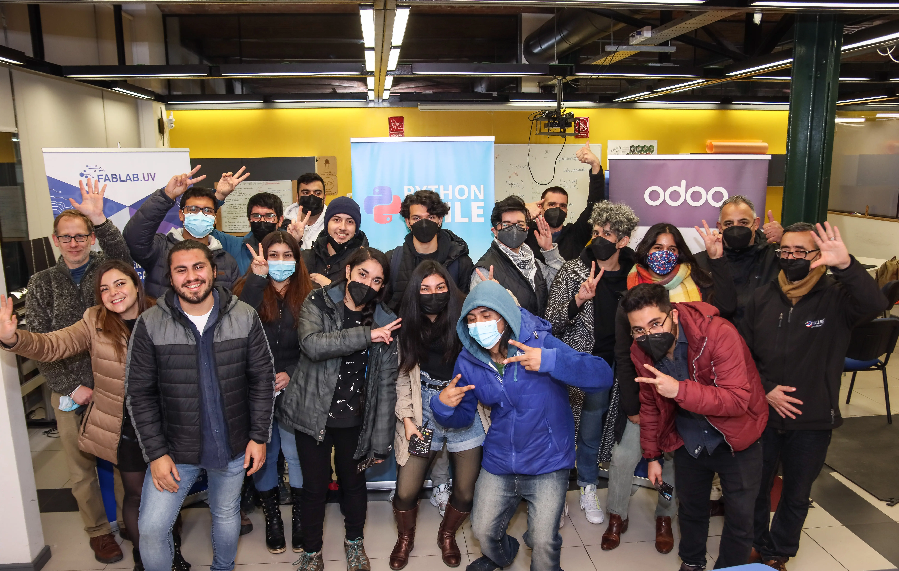
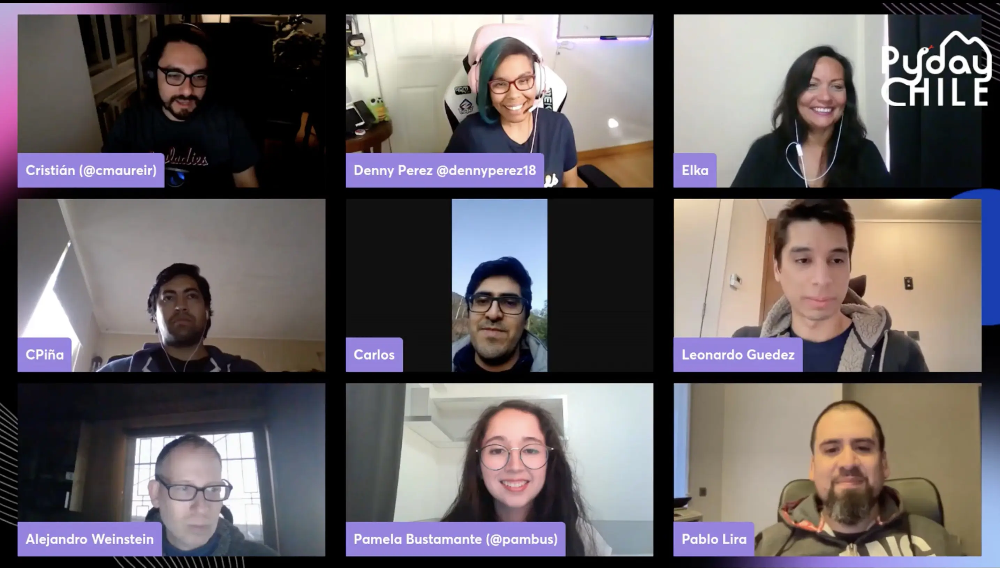

La comunidad de PythonChile organizó la segunda versión de la **PyDay Chile 2022**, una importante actividad que reúne a estudiantes, docentes y profesionales de la programación en torno a charlas, talleres y otras actividades relacionadas con Python.

Este año, la PyDay Chile 2022 se llevó a cabo en la ciudad de La Serena, en las instalaciones de la **Universidad Central**, así como en la ciudad de Valparaíso, en la **Universidad de Valparaíso**. Los asistentes, entre los que se encontraban alumnos, profesores y expertos de la zona, tuvieron la oportunidad de participar en distintas actividades relacionadas con el lenguaje de programación Python, incluyendo charlas y talleres.

Además, la organización del evento se preocupó de habilitar una versión en línea para que personas de distintas partes del país y del mundo pudieran participar. Esto demuestra el compromiso de la comunidad de **PythonChile** con la difusión y enseñanza de este lenguaje de programación.

La PyDay Chile 2022 también contó con importantes auspiciadores como [Uplanner](https://uplanner.com/es/), [Solotodo](https://www.solotodo.cl/), [IT-Talent](https://it-talenthh.com/) y [Austin Software](https://www.austinsoftware.com/), lo que contribuyó a que la actividad fuera un rotundo éxito. Los asistentes pudieron disfrutar de charlas impartidas por profesionales del área, y tener acceso a talleres prácticos que les permitieron profundizar en el conocimiento del lenguaje Python.

En la organización del evento destacamos la importancia de contar con actividades que fomenten la educación en tecnología y programación en el país, estamos satisfechos con la convocatoria y el éxito obtenido en esta edición de la PyDay Chile.

Si te perdiste la PyDay Chile 2022, no te preocupes, podrás encontrar más información en el sitio web [www.pyday.cl](https://pyday.cl) y ver las charlas grabadas en el canal de [YouTube de PythonChile](https://www.youtube.com/@PythonChile).

**Pyday Chile Serena 2022**

{: .image-process-large-photo}

**Pyday Chile Valparaíso 2022**

{: .image-process-large-photo}

**Pyday Chile Online 2022**

{: .image-process-large-photo}
