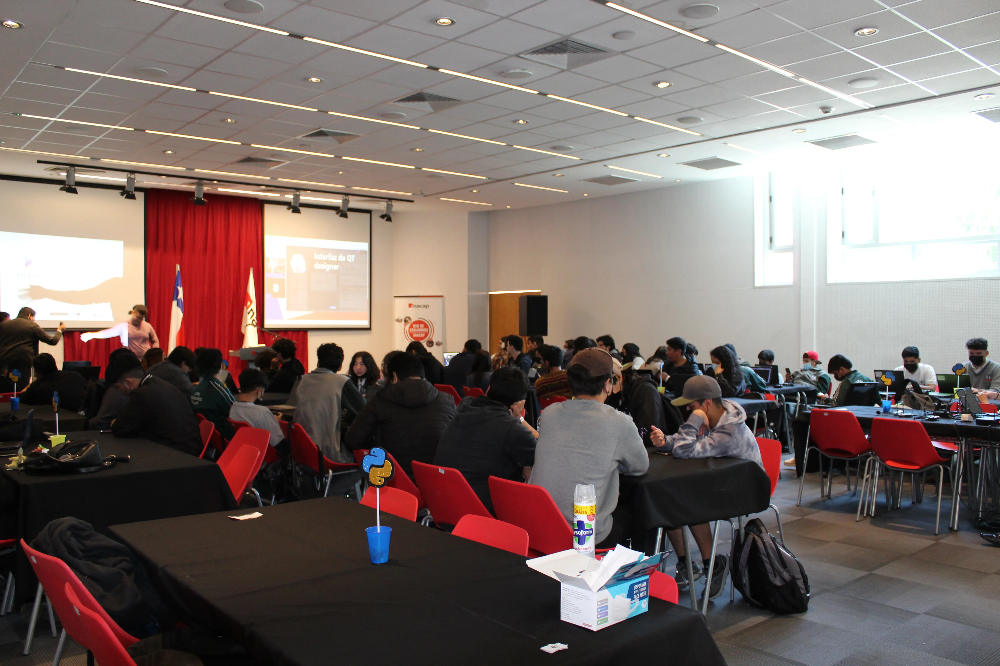
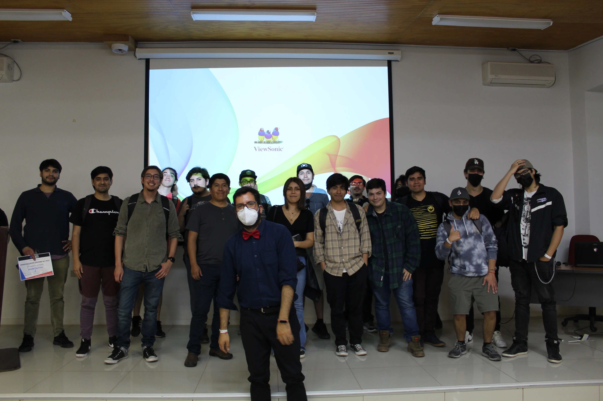
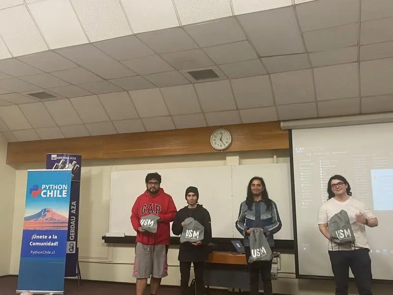
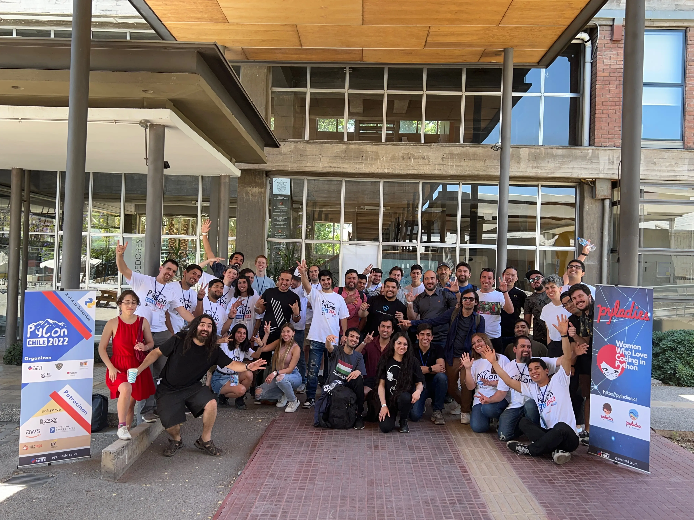
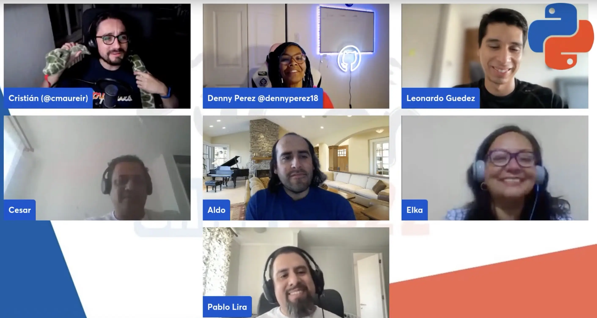

La **PyConChile** es uno de los eventos más importantes para la comunidad de Python en Chile. Se trata de una conferencia anual que reúne a expertos y apasionados del lenguaje de programación Python para compartir conocimientos, tendencias y experiencias en el campo de la tecnología. En la PyConChile, se presentan charlas, talleres y actividades que buscan fomentar el desarrollo de proyectos y el aprendizaje colaborativo en un ambiente de comunidad y cooperación. Este año, la PyConChile 2022 fue un evento con un gran éxito que contó con eventos satélites en distintas ciudades de Chile para que más personas pudieran participar de la conferencia.

La comunidad de Python de Chile se reunió del 2 al 4 de diciembre en un evento que contó con la participación de charlistas de distintas profesiones y especializaciones que utilizan Python en sus trabajos y proyectos. Pero eso no es todo, este año, debido al gran éxito de la **PyDayChile 2022** y la gran cantidad de solicitudes recibidas para realizar este evento, se tomó la decisión de organizar eventos satélites de la PyConChile en otras ciudades.

El evento satélite de **Copiapó**, llevado a cabo en el **Instituto Inacap** y en conjunto con la **Universidad de Atacama**, contó con la participación de alumnos y profesores que presentaron diversas charlas y talleres para la comunidad estudiantil y los asistentes de la ciudad. Durante la mañana, las actividades se realizaron en el Instituto Inacap, mientras que durante la tarde, la acción se trasladó a la Universidad de Atacama.

En el evento satélite de **Valparaíso**, llevado a cabo por la **Universidad Federico Santa María**, el centro de estudiantes de la casa central organizó una gran jornada con charlas y talleres para la comunidad de la región.

El evento principal en la ciudad de **Santiago** fue llevado a cabo en la **Universidad Católica** sede de San Joaquín, en conjunto con el capítulo de la ciencia de la computación. Durante todo el día, se realizaron charlas y talleres con charlistas de distintas profesiones, especializaciones y experiencias. El último día del evento, se realizó una versión completamente online para que las personas que no pudieron asistir presencialmente tuvieran un espacio de unión. Este último día contó con dos track y más de 20 charlas.

En total, la PyConChile 2022 duró tres días y se realizaron aproximadamente 50 charlas, con una excelente asistencia de la comunidad de Python de Chile. Además, el evento contó con grandes auspiciadores como [Softserve](https://career.softserveinc.com/en-us/chile), [AWS](https://aws.amazon.com/), [Python Institute](https://pythoninstitute.org/), [Howdy](https://pycon.cl/assets/images/partner/logo_howdy.png), [SoloTodo](https://solotodo.cl/) y [EY](https://www.ey.com/es_cl). Desde la organización, se sienten muy felices y orgullosos de haber realizado un evento tan exitoso y esperan continuar organizando más eventos satélites en otras ciudades para que la comunidad de Python pueda seguir creciendo en todo Chile.

En definitiva, la PyConChile 2022 ha sido una gran oportunidad para que la comunidad de Python de Chile se reúna, comparta conocimientos y experiencias, y aprenda sobre las últimas tendencias en la industria de la tecnología. ¡Enhorabuena a todos los que participaron y esperamos verlos en la próxima edición!

Si te perdiste la PyConChile 2022, no te preocupes, podrás encontrar más información en el sitio web [www.pycon.cl](https://pycon.cl) y ver las charlas grabadas en el [canal de YouTube de PythonChile](https://www.youtube.com/@PythonChile).

**PyConChile Satelite copiapó 2022 (instituto Inacap y Universidad Atacama)**

{: .image-process-large-photo}

**PyConChile Satelite copiapó 2022 (Universidad Atacama)**

{: .image-process-large-photo}

**PyConChile Satelite Valparaíso 2022 (Santa maria Casa Central)**

{: .image-process-large-photo}

**PyConChile Santiago 2022 (Universidad Catolica sede San Joaquin)**

{: .image-process-large-photo}

**PyConChile Virtual 2022**

{: .image-process-large-photo}
