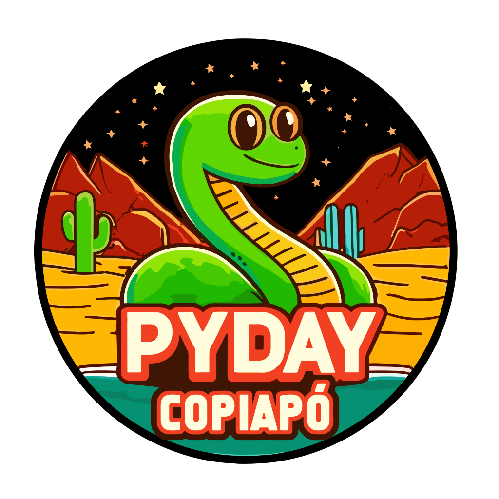
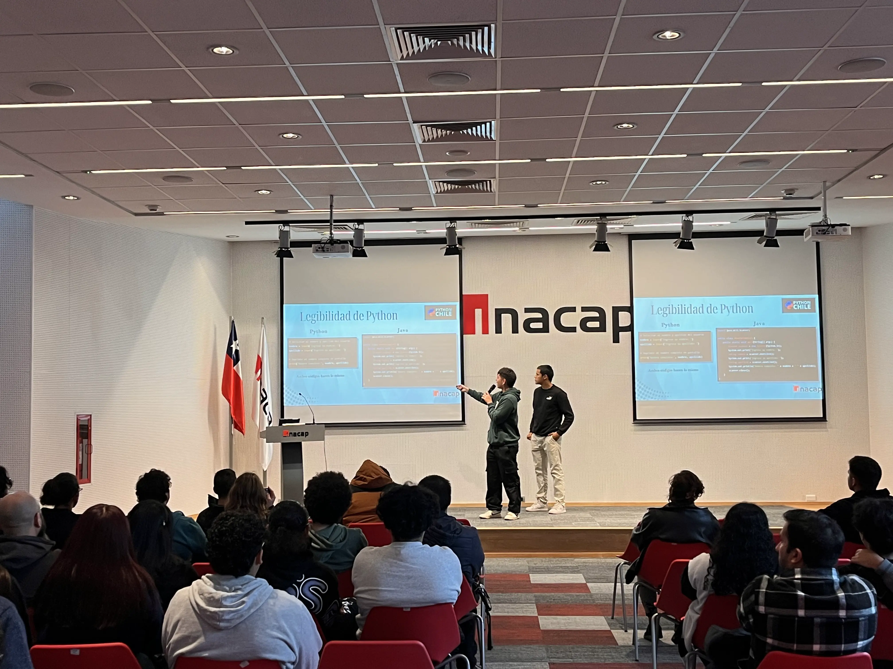
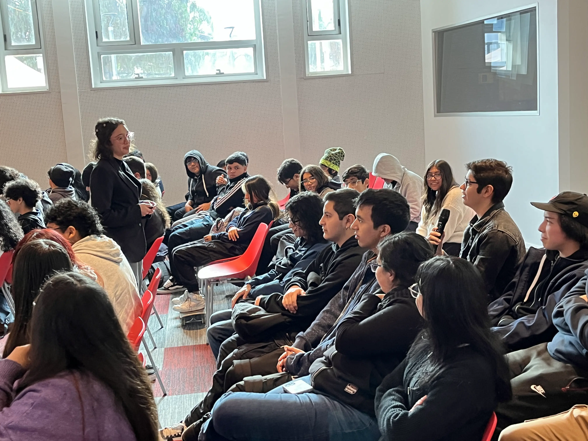
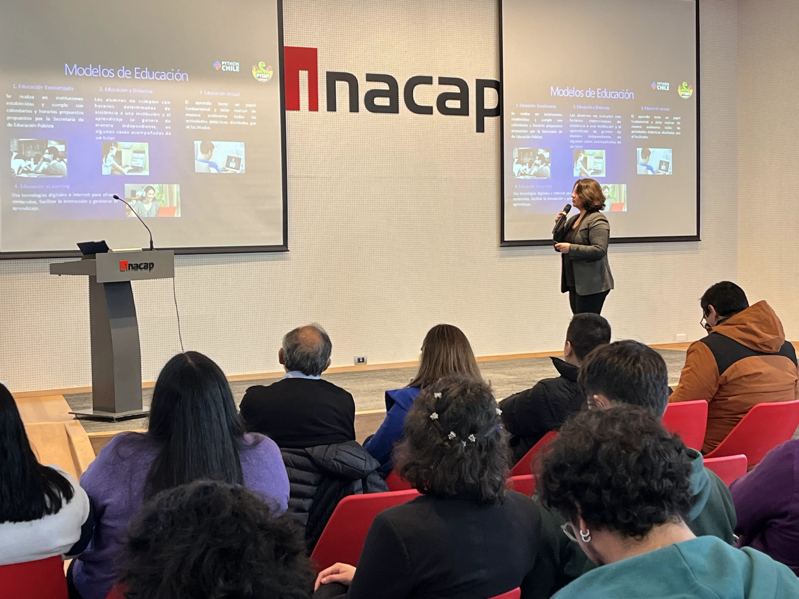
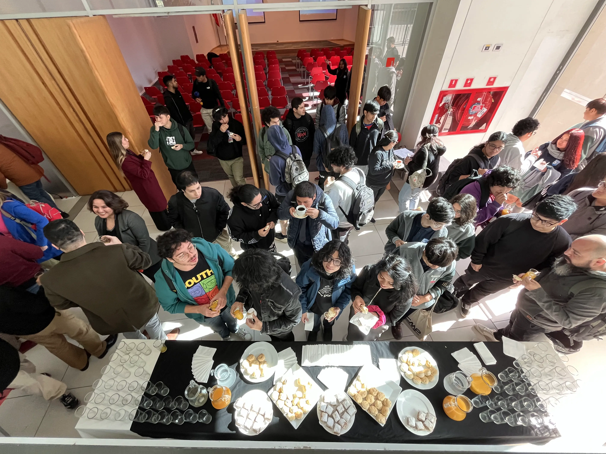
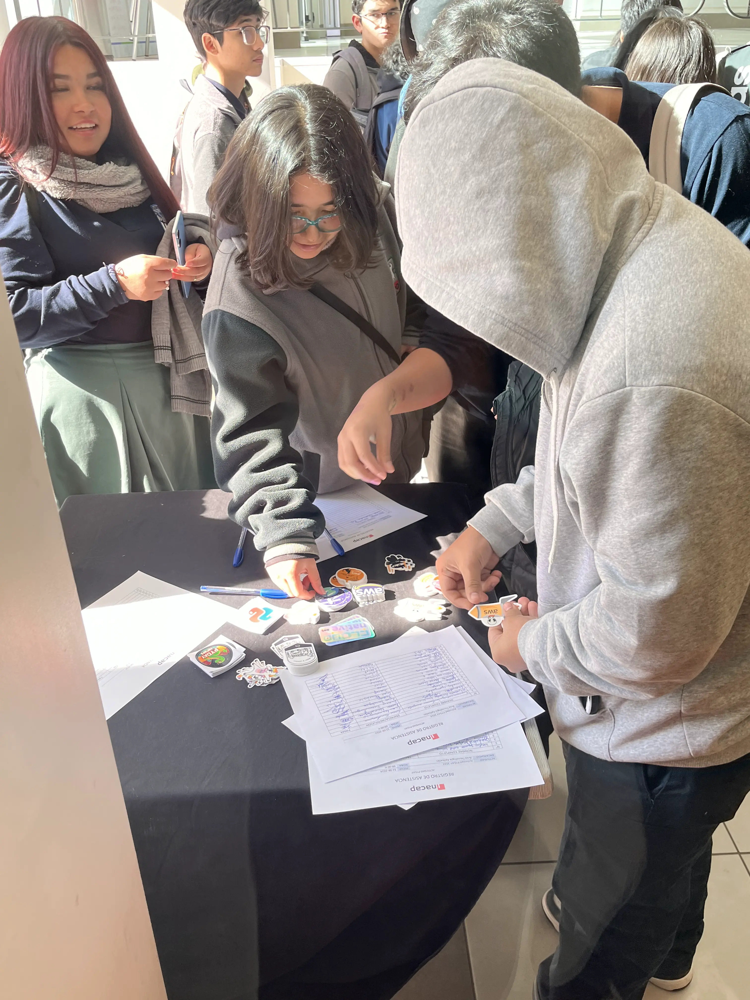
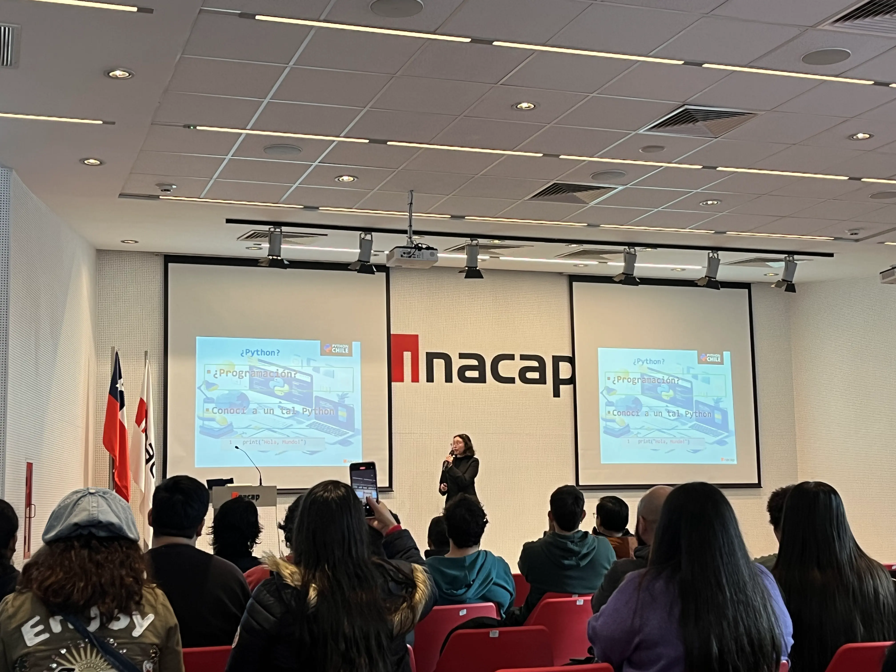

¡Hola, entusiastas de Python! 👋

El pasado **12 de junio de 2024**, tuvimos el honor de participar en una de las conferencias más esperadas del año: **¡PyDay 2024 Copiapó!** 🎉🎊. Este evento tuvo lugar en [**Inacap sede Copiapó**](https://portales.inacap.cl/sedes/copiapo/), donde se reunieron expositores, profesores y amantes de la informática y la tecnología de toda la región. 🌐💻

 

## 🌟 Charlas Destacadas 🗣️

La conferencia estuvo repleta de charlas fascinantes que capturaron la esencia y el poder del lenguaje de programación **Python**. Aquí te contamos sobre algunas de ellas:

### 🐍 Primeros Pasos en Python 🐾
Ideal para aquellos que están comenzando su aventura en el mundo de Python. Esta charla cubrió los fundamentos esenciales y mostró cómo dar los primeros pasos en este increíble lenguaje. ¡Perfecto para principiantes! 🚀

### 🤖 Python Aplicado a IA Generativa usando Google Vertex IA 🤯
¡Wow! Esta charla fue una verdadera joya para los fanáticos de la inteligencia artificial. Exploramos cómo Python se integra con **Google Vertex IA** para crear aplicaciones de IA generativa. ¡La tecnología del futuro, hoy! 🌟

### 🔍 Redes Convolucionales y Python 🧠
Profundizamos en el fascinante mundo de las redes convolucionales, una herramienta clave en la visión por computadora. Aprendimos cómo Python facilita el desarrollo y entrenamiento de estas redes. ¡Absolutamente fascinante! 🌐

## 🤝 Un Espacio para Conectar 🌟

Más allá de las charlas, **PyDay 2024 Copiapó** fue un excelente espacio para reunirse y conectar con otros apasionados de la tecnología. Fue una oportunidad única para intercambiar ideas, colaborar en proyectos y hacer nuevas amistades en el mundo de la informática. 💬👥

La energía y el entusiasmo en el ambiente eran contagiosos, y cada conversación era una oportunidad para aprender algo nuevo. ¡Gracias a todos los que asistieron y contribuyeron a hacer de este evento un éxito rotundo! 🎉👏

## 📸 Momentos Inolvidables

Aquí te dejamos algunas fotos que capturan la esencia de este maravilloso día:

📚 Recursos y Enlaces Útiles

Si quieres revisar las presentaciones de las charlas o conocer más sobre futuros eventos, aquí tienes algunos enlaces útiles:

📂 [Presentaciones de PyDay 2024 Copiapó](https://github.com/KrlitosForever/Pyday2024-Inacap)

🌐 [Página oficial de PyDay](https://pyday.cl)

Si te lo perdiste, no te preocupes. ¡PyDay volverá con más fuerza el próximo año! Mientras tanto, sigue explorando y disfrutando del increíble mundo de Python. 🐍💡

¡Nos vemos en la próxima aventura tecnológica! 🚀

🙌 ¡Hasta la Próxima!
