¡Qué día tan increíble vivimos en **PyDay Valparaíso 2024**! 🎉

El pasado sábado, el **FabLab de la Facultad de Ingeniería** se transformó en un verdadero centro de innovación y creatividad, albergando la tercera edición de este emocionante evento. Durante toda la jornada, se vivió una atmósfera vibrante y llena de energía, desde principiantes hasta expertos, se reunieron para compartir conocimientos, aprender juntos y fortalecer la comunidad tecnológica.

## 🌟 Charlas Inspiradoras y Contenido de Vanguardia

PyDay Valparaíso 2024 fue un despliegue de talento y conocimiento sin precedentes. Comenzamos con una fascinante charla sobre **procesamiento de señales definidas sobre grafos**, donde los asistentes descubrieron nuevas formas de entender y manipular datos complejos. Luego, exploramos el **diseño de chips analógicos**, una ventana hacia el futuro de la electrónica impulsada por Python.

No nos detuvimos ahí: también profundizamos en la **inteligencia artificial generativa** y su integración con Python a través de técnicas avanzadas como el *prompt engineering*. Estas charlas no solo brindaron herramientas y recursos valiosos, sino que también encendieron la chispa de la curiosidad y el deseo de seguir explorando en cada uno de los participantes. ¡La emoción era palpable!

## 🌐 Creando Conexiones y Ampliando Horizontes

Además del aprendizaje técnico, **PyDay Valparaíso 2024** fue una oportunidad única para crear lazos y forjar conexiones significativas dentro de la comunidad. El ambiente colaborativo del FabLab facilitó el intercambio de ideas, el desarrollo de nuevos proyectos y la construcción de relaciones profesionales que perdurarán más allá del evento.

La diversidad de los asistentes, provenientes de diferentes ciudades y con diferentes niveles de experiencia, demostró que Python es un lenguaje que une, inspira y motiva a personas de todas partes. Esta diversidad hizo que las conversaciones fueran ricas, significativas y llenas de oportunidades para aprender unos de otros.

## 🙏 Agradecimientos a Nuestra Comunidad y Voluntarios

Este evento no habría sido posible sin el esfuerzo y la dedicación de muchas personas. Queremos agradecer de corazón a [Cristina](https://www.linkedin.com/in/cristina-verdugo-palma-9a9995255/),Jeshu , [Alejandro](https://www.linkedin.com/in/alejandro-weinstein-8610a43), y [Sebastian](https://www.linkedin.com/in/sebastiandres/) por su impecable organización y liderazgo. También extendemos un enorme agradecimiento a los múltiples voluntarios que trabajaron arduamente durante toda la jornada, asegurando que cada detalle estuviera perfecto. 🙌

## 📺 ¡Revive la Experiencia en Nuestro Canal de YouTube!

Sabemos que algunos no pudieron unirse en persona, ¡pero no se preocupen! Todas las charlas y presentaciones están disponibles en nuestro canal de YouTube para que puedas revivir estos momentos y seguir aprendiendo: [Ver Charlas en YouTube](https://www.youtube.com/watch?v=6AWDEZY_iZI). ¡No te lo pierdas!

## 🚀 Únete a Nuestra Comunidad en Crecimiento

**PyDay Valparaíso 2024** fue solo el comienzo de muchas más aventuras por venir. Nuestra comunidad de Python en Chile sigue creciendo rápidamente, y queremos que tú seas parte de ella. Si te apasiona la programación, la tecnología o simplemente deseas conectar con personas que comparten tus intereses, ¡te invitamos a unirte! No importa si eres un principiante o un desarrollador experimentado; hay un lugar para todos en nuestra comunidad. 🐍💡

## 🌍 Conéctate con los Miembros de Nuestra Comunidad

agradecemos a los que contribuyeron al éxito de este evento:

- [Francisco Alfaro](https://www.linkedin.com/in/faam)
- [Oscar Cariceo](https://www.linkedin.com/in/ocariceo)
- [Elizabeth Fuentes](https://www.linkedin.com/in/lizfue)
- [Cristina Verdugo](https://www.linkedin.com/in/cristina-verdugo-palma-9a9995255/)
- [Alejandro Weinstein](https://www.linkedin.com/in/alejandro-weinstein-8610a43)
- [Sebastian Andres](https://www.linkedin.com/in/sebastiandres/)

No olvides seguirnos en redes sociales y estar atento a futuros eventos. ¡Juntos, podemos hacer crecer esta increíble comunidad aún más!

## 🌈 Hasta la Próxima Aventura Tecnológica

¡Gracias a todos por hacer de **PyDay Valparaíso 2024** un evento inolvidable! Ya estamos ansiosos por el próximo encuentro donde seguiremos compartiendo, aprendiendo y disfrutando de nuestra pasión por Python. ¡Nos vemos en la próxima aventura tecnológica! 🚀✨

## 📸 Momentos Inolvidables

Aquí te dejamos algunas fotos que capturan la esencia de este increíble evento:

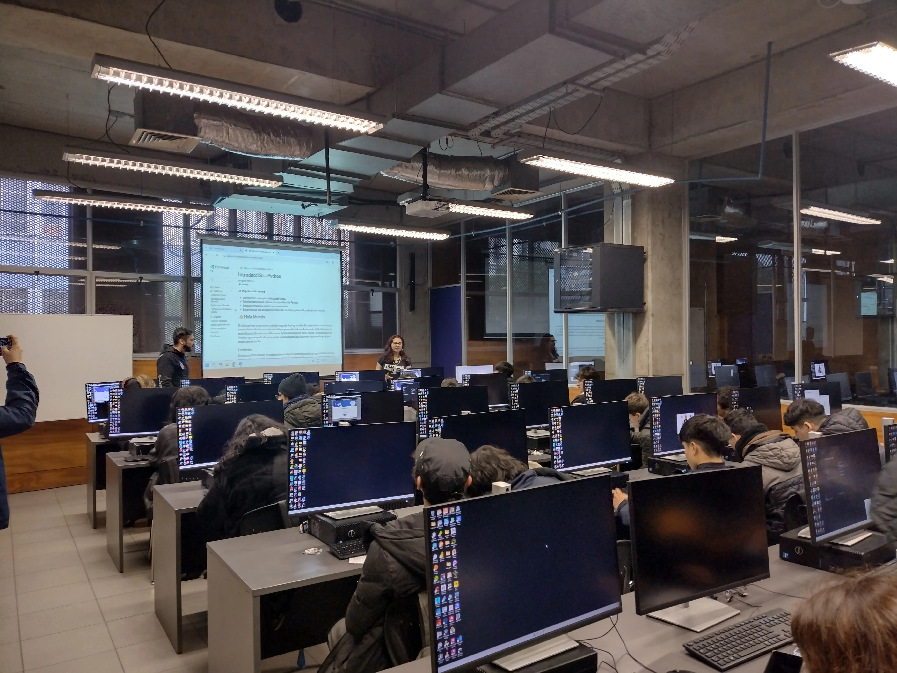
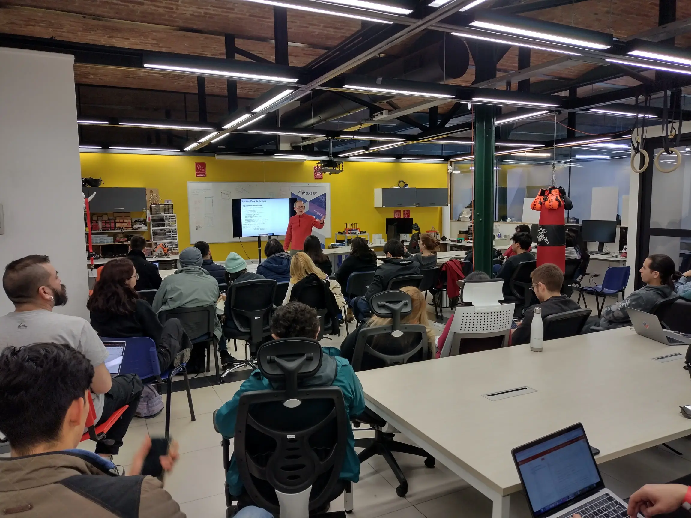
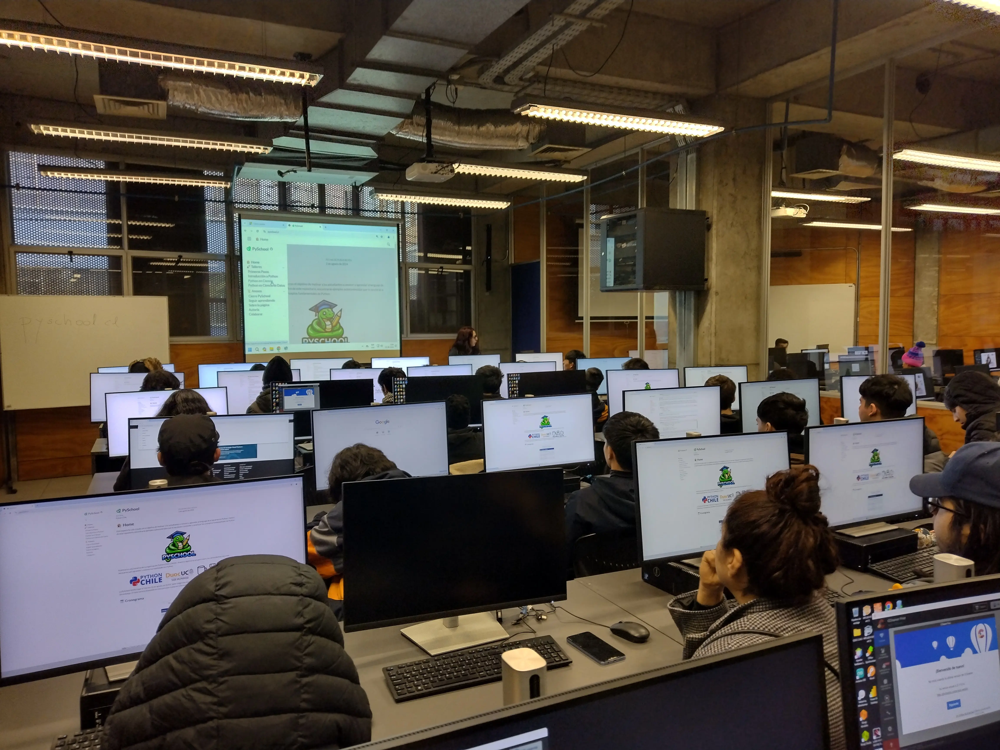
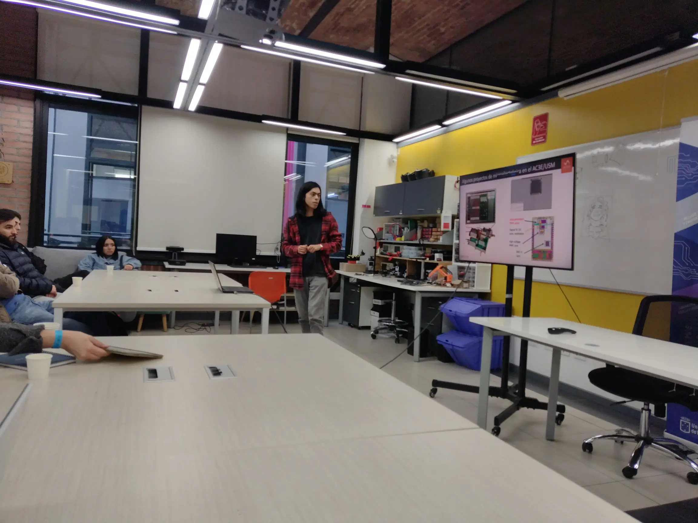
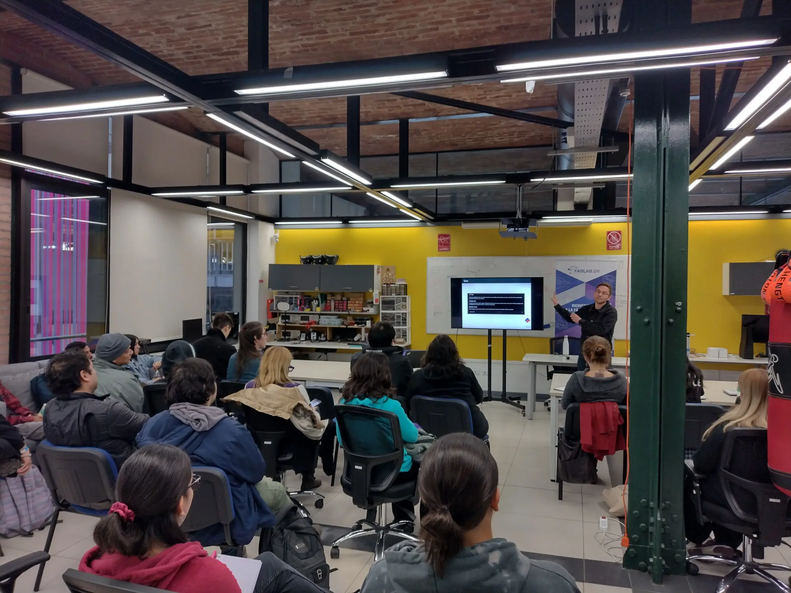
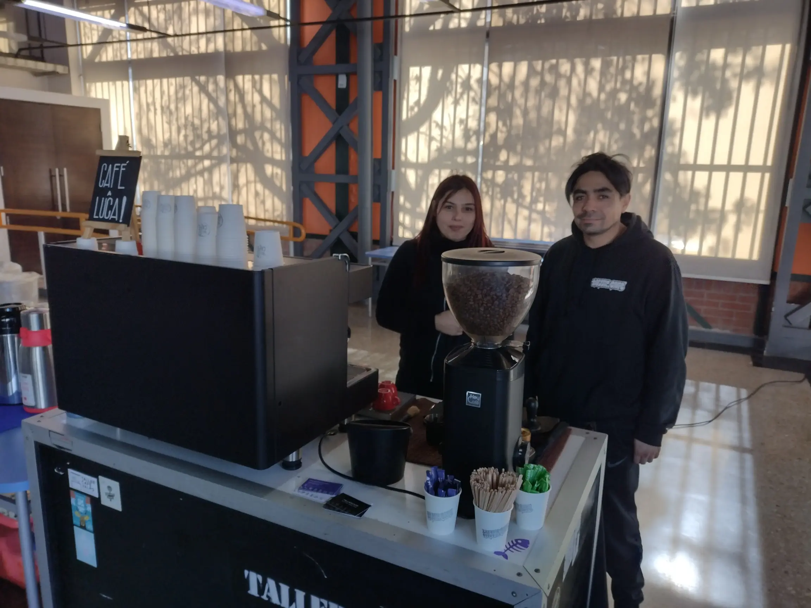
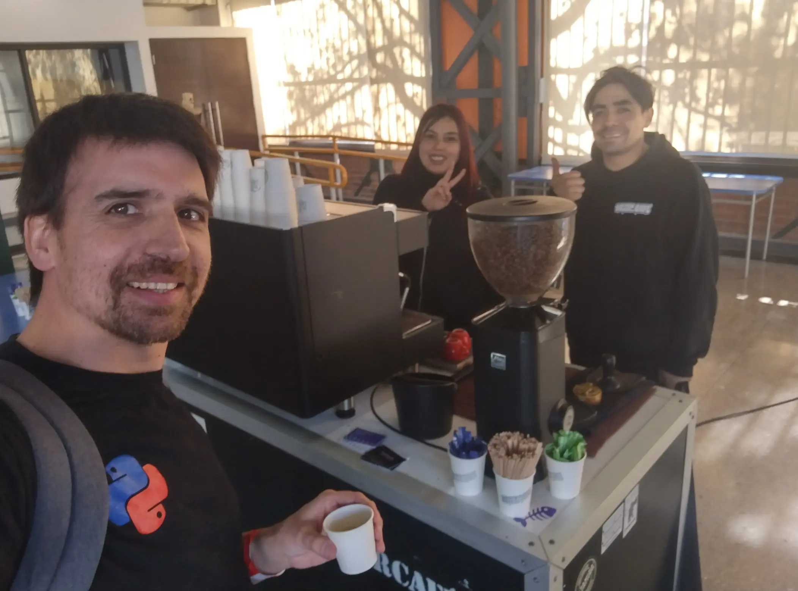
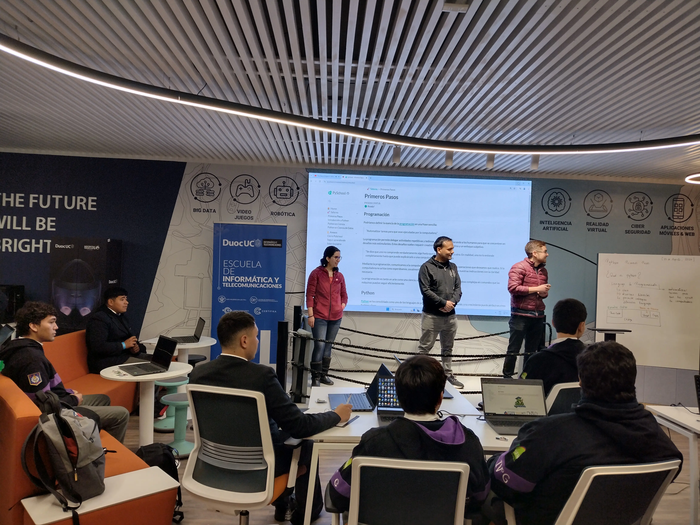
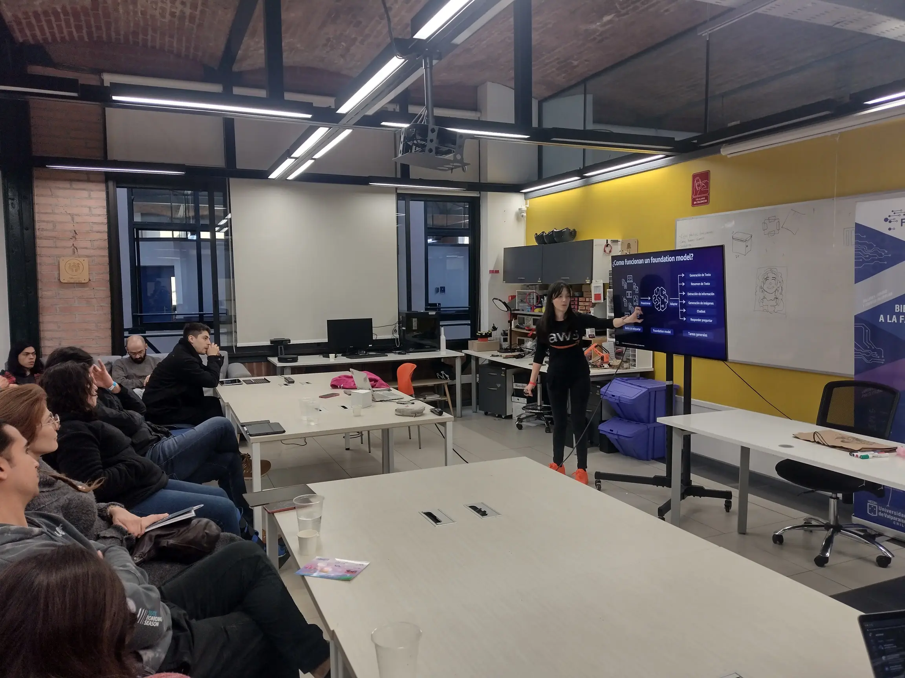
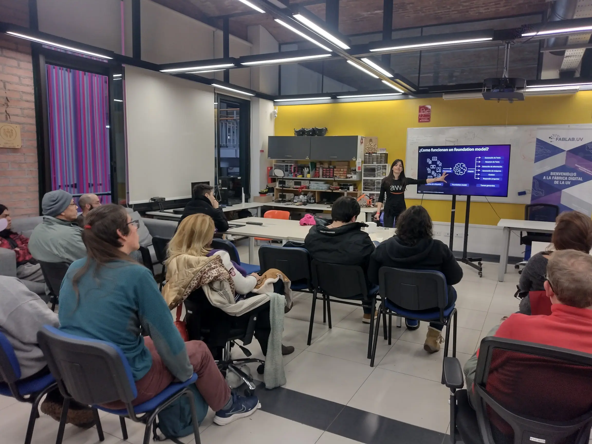
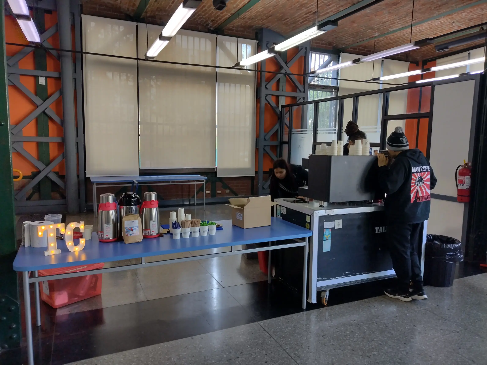
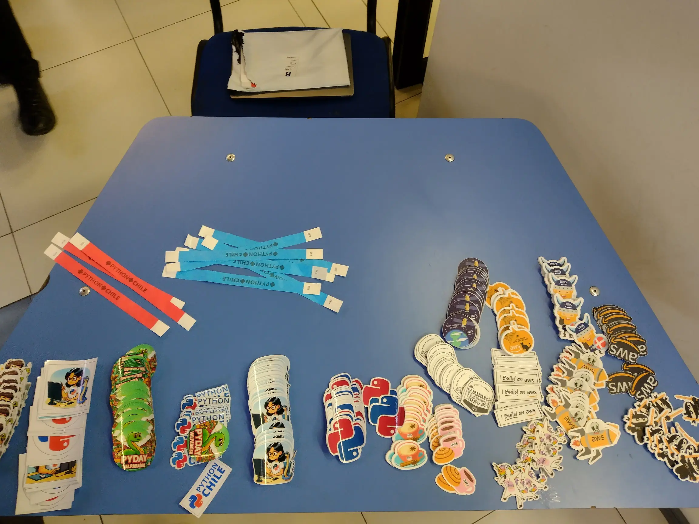

---

