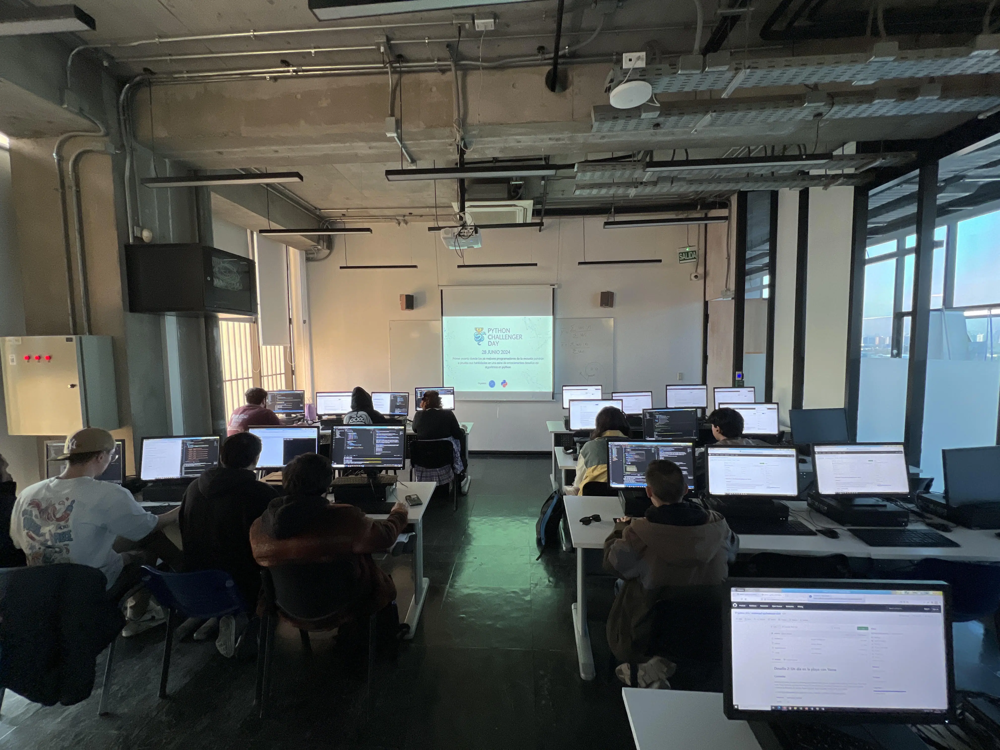
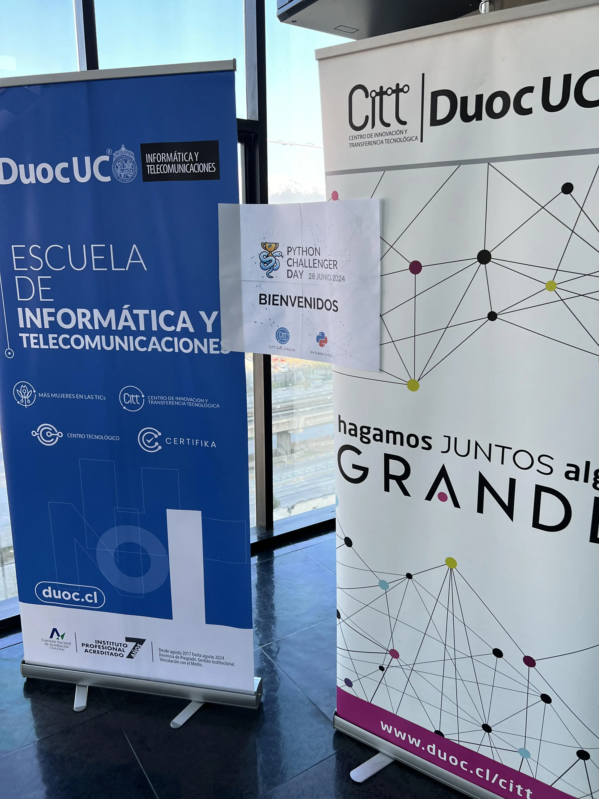
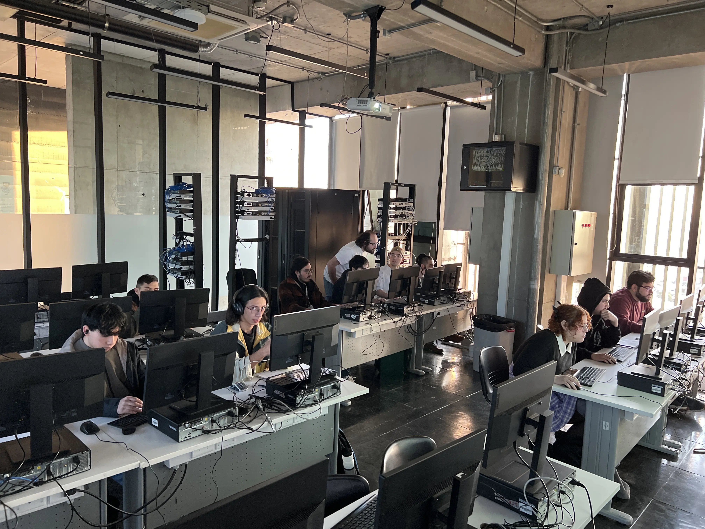

¡Hola a todos los amantes de Python! 👋

El pasado viernes 28 de junio, se llevó a cabo el emocionante evento Python Challenger Day, organizado por el Centro de Innovación y Transferencia Tecnológica (CITT) de DUOC. Esta jornada fue especial para nuestra comunidad, ya que dos de nuestros miembros, Aldo Caneo y Juan Cuellar, participaron como instructores/examinadores, aportando su experiencia y conocimientos durante el desarrollo del evento. 🎓✨

## 🌟 Entusiasmo y Compromiso 🗣️

Los alumnos participantes, de primero a cuarto año de la carrera Analista Programador, demostraron un increíble entusiasmo y compromiso. Durante la actividad, enfrentaron problemas complejos y desafiantes que pusieron a prueba su capacidad analítica y sus conocimientos de programación en Python. ¡La competencia fue feroz y emocionante! 💪🔥

## 🔍 Evaluación y Reconocimientos 🏅

Al finalizar la competencia, se realizó una evaluación exhaustiva de los programas desarrollados. Los instructores y examinadores seleccionaron a los ganadores del evento, quienes recibieron un merecido reconocimiento por su destacado desempeño. 🎉👏

## 🎉 Un Día para Recordar

El Python Challenger Day no solo fue una competencia, sino también una oportunidad para que los estudiantes demostraran sus habilidades y aprendieran de la experiencia. Fue un día lleno de aprendizaje, camaradería y logros, que sin duda será recordado por todos los participantes. 📚🤝

## 📸 Momentos Inolvidables

Aquí te dejamos algunas fotos que capturan la esencia de este increíble evento:

## 🙌 ¡Gracias a Todos!

Queremos agradecer a todos los participantes, organizadores e instructores que hicieron posible este evento. ¡Esperamos verlos en futuros desafíos y seguir celebrando los logros de nuestra comunidad! 🎉🐍
