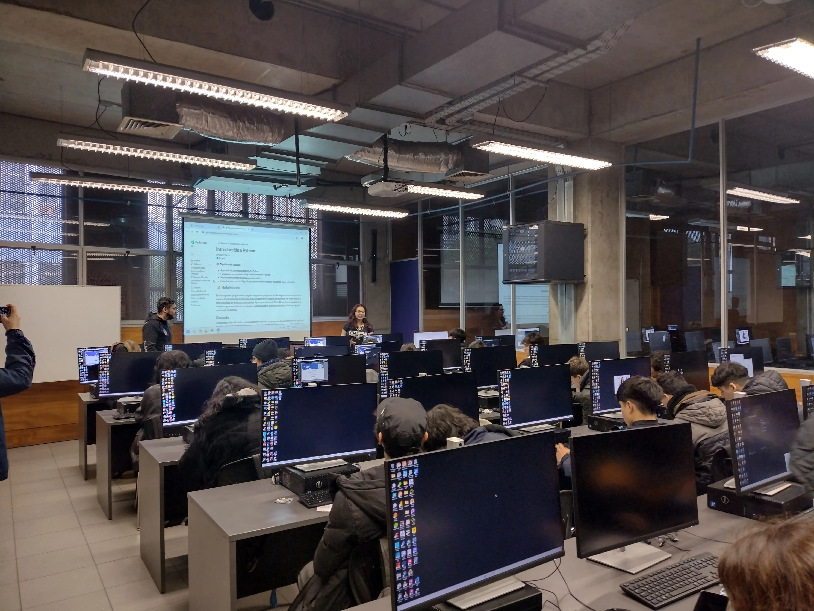
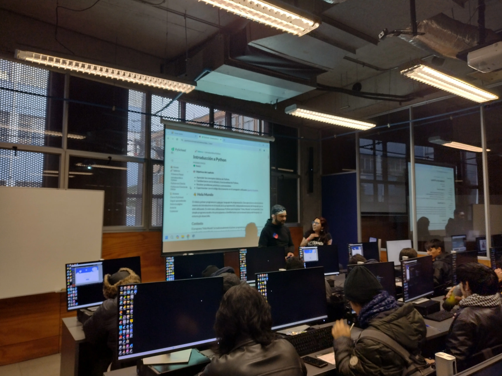
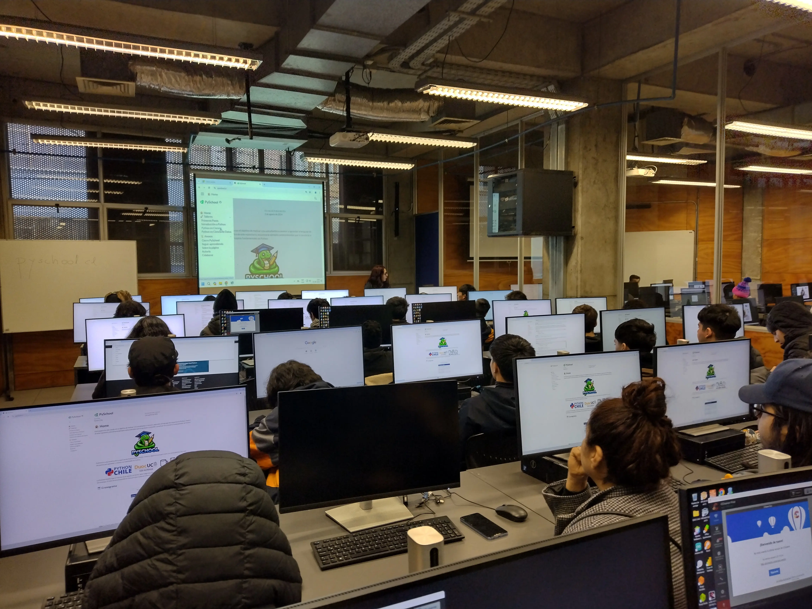
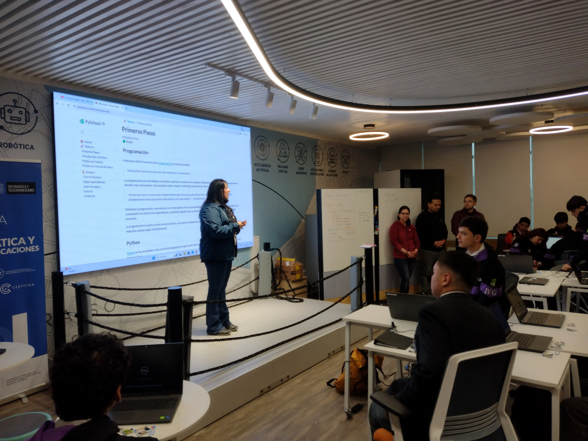
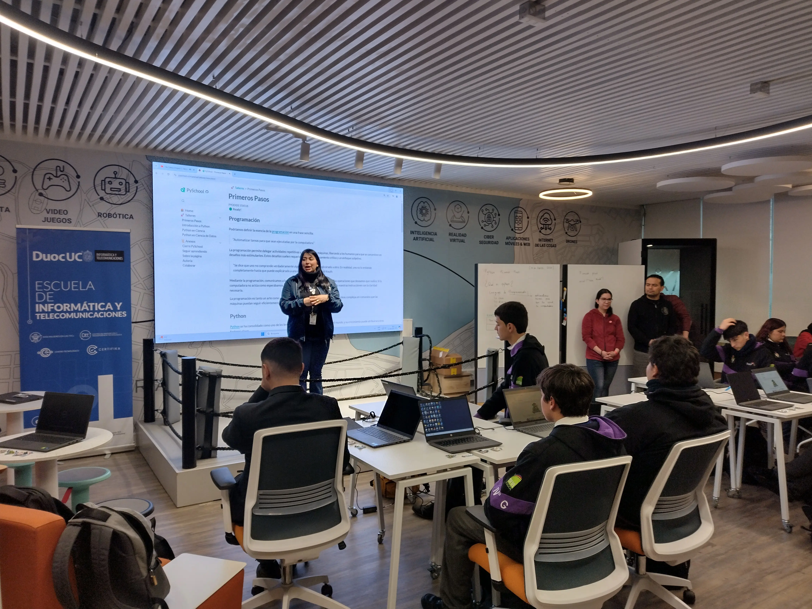
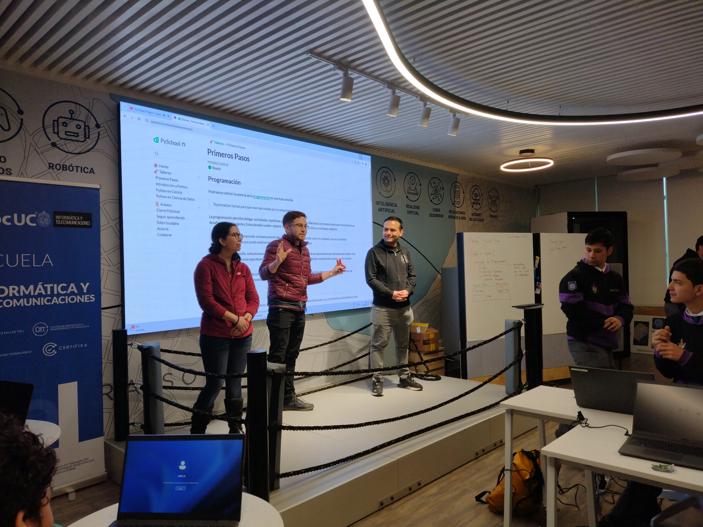

¡Hola a toda la comunidad Python! 🐍👋

El pasado viernes 23 de agosto, Python Chile, en colaboración con DUOC UC, llevó a cabo **PySchool**, un evento educativo que tuvo lugar en la Sede Valparaíso, diseñado específicamente para proporcionar a estudiantes de la V Región los recursos y el ambiente necesario para aprender y mejorar sus habilidades en Python. Este evento no solo destacó por su contenido técnico, sino también por su enfoque en la construcción de comunidad y el fomento del aprendizaje colaborativo.

## 📚 Talleres de Introducción y Ciencia de Datos: Abriendo Puertas al Futuro

El día comenzó con el taller "Introducción a Python", dirigido a estudiantes que daban sus primeros pasos en el mundo de la programación. Esta sesión inicial proporcionó una base sólida para que los participantes pudieran entender los conceptos fundamentales de Python, uno de los lenguajes más versátiles y populares en la industria tecnológica actual.

Luego, la jornada continuó con el taller "Python en Ciencia de Datos", una experiencia práctica que permitió a los estudiantes explorar cómo Python puede ser utilizado en análisis de datos y resolución de problemas del mundo real. Desde la manipulación de datos hasta la creación de modelos predictivos, los estudiantes aprendieron cómo Python se aplica en una de las áreas más demandadas del mercado laboral actual. La energía en el salón era evidente, con participantes emocionados de descubrir las posibilidades infinitas que Python puede ofrecer en sus futuras carreras.

## 🌐 Compartiendo el Conocimiento Más Allá del Evento

Aunque PySchool fue un evento exclusivo para los estudiantes invitados de ciertas escuelas de la V región, Python Chile se comprometió a democratizar el acceso al conocimiento. Por eso, el material de los talleres se ha puesto a disposición en línea en [pyschool.cl](https://pyschool.cl). Esta iniciativa garantiza que cualquier persona interesada pueda acceder a estos valiosos recursos educativos, sin importar su ubicación geográfica, alentando así a más personas a iniciarse en el mundo de Python.

## 🏞️ Descubriendo Valparaíso: Más Allá de la Programación

El evento no solo fue una oportunidad para aprender, sino también para explorar y disfrutar la ciudad de Valparaíso. Después de los talleres, los participantes tuvieron la oportunidad de recorrer las icónicas calles coloridas de la ciudad, apreciar su vibrante arte callejero y disfrutar de la brisa del mar. Valparaíso, con su energía creativa y su singularidad, ofreció un marco perfecto para cerrar un día lleno de aprendizajes y conexiones significativas.

## 🙏 Agradecimientos a Nuestra Comunidad y Colaboradores

Python Chile extiende su más sincero agradecimiento a todos los que hicieron posible este evento. Un agradecimiento especial a [Yileanne](https://www.linkedin.com/in/yileanne), [Valeska](https://www.linkedin.com/in/vcanalesp), [Francisco](https://www.linkedin.com/in/faam/),[Bastian](https://www.linkedin.com/in/blandskron/), [Liliana](https://www.linkedin.com/in/liliana-garmendia-c/), [Cristian](https://www.linkedin.com/in/cristianl0pez/) y a la organización a cargo de [Seba](https://www.linkedin.com/in/sebastiandres/), cuyo esfuerzo y dedicación fueron clave para el éxito del evento. También agradecemos a [café-robots-galletas](https://www.caferobotsygalletas.cl/) por su generosa donación de giftcards, que añadieron un toque especial y alegría a los participantes. ☕🎁

## 🚀 ¡Únete a Nuestra Comunidad en Crecimiento!

La comunidad de Python en Chile sigue creciendo a pasos agigantados. Si te apasiona Python, la programación o simplemente deseas conectar con personas que comparten tu interés, ¡te invitamos a unirte a nosotros! No importa si eres principiante o experto; hay un lugar para ti en nuestra comunidad. 🐍🎉

---

No te olvides de seguir a [café-robots-galletas](https://www.instagram.com/caferobotsygalletas/) en Instagram para más novedades.

🌐 [Página oficial de PyDay](https://pyday.cl)

Si te lo perdiste, no te preocupes. ¡PyDay volverá con más fuerza el próximo año! Mientras tanto, sigue explorando y disfrutando del increíble mundo de Python. 🐍💡

¡Nos vemos en la próxima aventura tecnológica! 🚀

🙌 ¡Hasta la Próxima!
