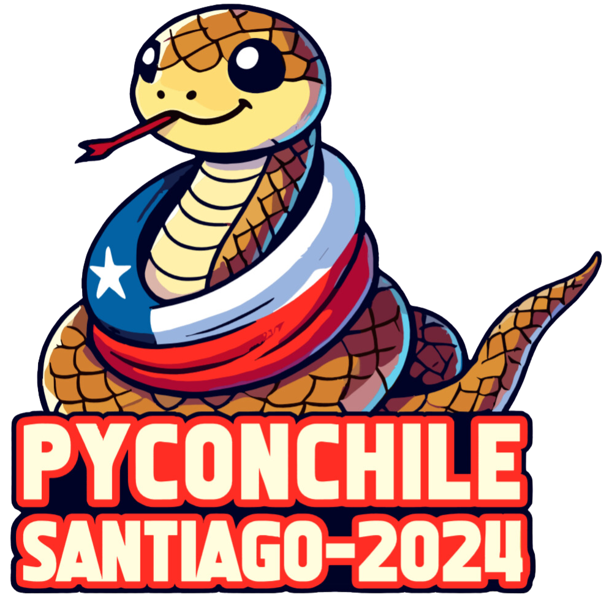
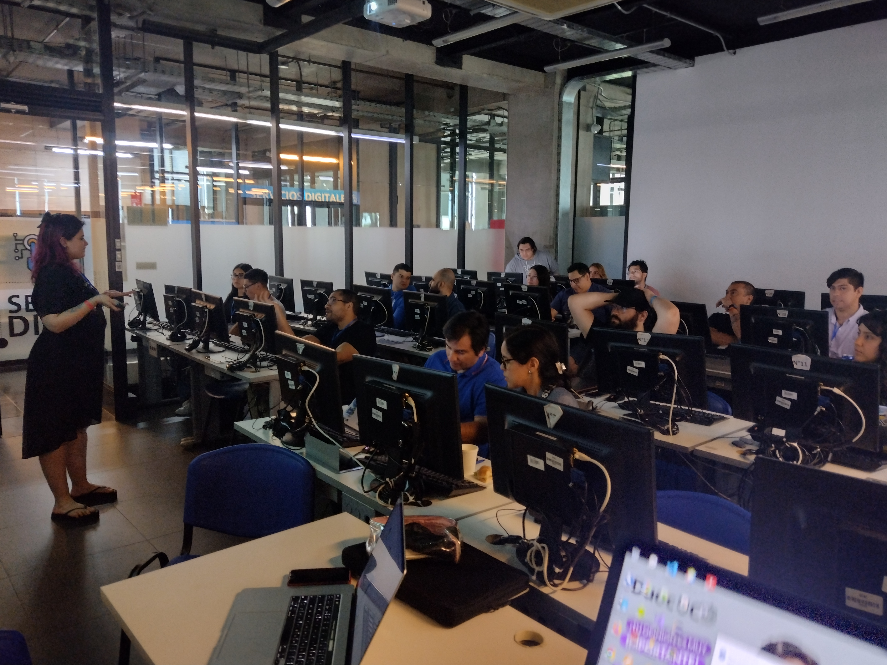

¡Hola, amantes de Python! 👋

El pasado **30 de noviembre**, se celebró la tan esperada **PYCON**, un evento organizado por la **Comunidad Python Chile** en la sede **DuocUC San Joaquín**. Fue un día repleto de inspiración, aprendizaje y conexiones, que incluyó charlistas internacionales de lujo y talleres prácticos que dejaron a todos con ganas de más. 🚀✨

## 🌍 Keynotes y Charlas Memorables 🗣️

Tuvimos el privilegio de contar con **Denny Pérez**, quien abrió el evento con una **keynote** de primer nivel sobre **Python y Comunidad**, destacando el impacto global de este lenguaje y su increíble ecosistema. Además, **Andrés Pineda** nos maravilló con su charla sobre las aplicaciones de Python con **PyScript**, mostrando nuevas formas de aprovechar este poderoso lenguaje. 💡🔥

Y eso no fue todo: otras charlas de altísimo nivel completaron un programa que dejó a todos los asistentes fascinados y con nuevas ideas para explorar. 🙌📚

## 🛠️ Talleres: ¡Aprendiendo con Código! 🖥️

Los talleres fueron uno de los puntos altos del evento. Python es un lenguaje eminentemente práctico, y qué mejor manera de aprender que **practicando**. Los asistentes se sumergieron en código y salieron con nuevas herramientas y habilidades listas para aplicar. ¡Fueron un éxito absoluto! 💻✨

## ☕ Networking, Stickers y Más 🎉

Durante los **coffee breaks** y el almuerzo, los asistentes aprovecharon para hacer networking, conocer a otros entusiastas de Python y conversar sobre sus proyectos e ideas. ¡Los stickers también fueron un hit! 🎨🐍

## 📡 Día 2: ¡Online y con Tracks Simultáneos! 🌐

El día **1 de diciembre**, la acción continuó de manera online, con **dos tracks simultáneos** que comenzaron a las **9:15 AM** y se extendieron hasta cerca de las **6:30 PM**. La variedad de charlas y la interacción virtual mantuvieron el entusiasmo al máximo, llegando a más personas y consolidando aún más esta increíble experiencia. 🌍💻

## 📸 Momentos Inolvidables

Aquí te dejamos algunas fotos que capturan la esencia de este evento único:

## 🙌 ¡Gracias a Todos

Queremos agradecer a los charlistas, organizadores y asistentes que hicieron posible este evento. **PYCON 2024** fue una experiencia increíble, y ya estamos esperando la próxima edición para seguir aprendiendo y creciendo juntos como comunidad. 🎉🐍
Si quieres ser parte del voluntariado no dudes en rellenar el formulario [Formulario de inscripción](https://docs.google.com/forms/d/e/1FAIpQLSdhHlnqwmYffl6JNzbAZ4IRRyM_8fcOB1QH0hyz6Vwi3VFOwg/viewform?usp=sf_link) nos vemos en los siguientes eventos 👋
