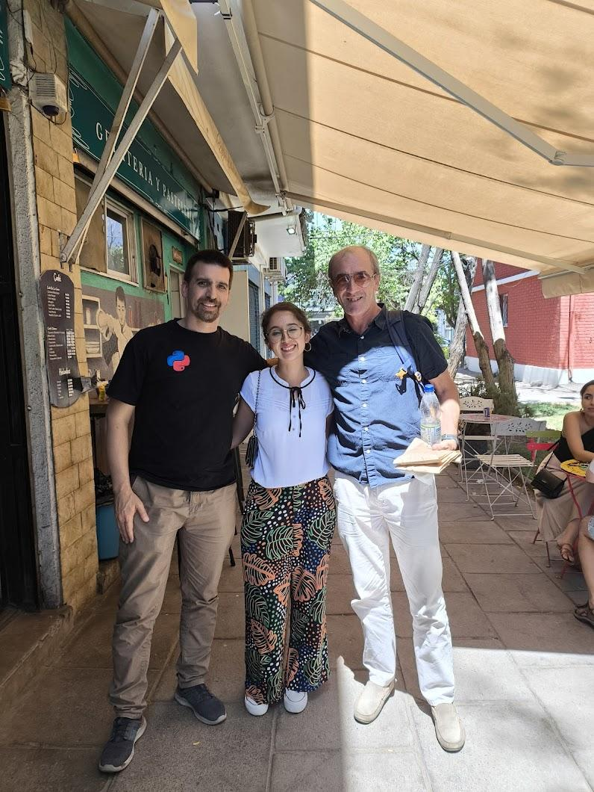

A principios de enero, en Python Chile, recibimos un correo en inglés. Andy Robinson, pythonista británico, estaría visitando Santiago a mediados de febrero y ofrecía su disponibilidad para dar una charla o tener una conversación. Febrero es un mes tranquilo para Python Chile, ya que tanto los voluntarios como los asistentes habituales suelen estar de vacaciones, así que decidimos simplemente reunirnos para conversar.  

Durante la charla, descubrimos que Andy fue uno de los primeros pythonistas en el Reino Unido y autor del libro *Python: Programming on Win32*. En esos días, Python aún era un lenguaje emergente, lejos de la popularidad que alcanzaría más tarde en la industria.  

Python: Programming on Win32 fue una de las primeras obras en abordar el uso de Python en sistemas Windows, un campo entonces poco explorado.  

Hoy, el tiempo de Andy se divide entre su familia, su empresa [ReportLab](https://www.reportlab.com), la plataforma [OpenTrack](https://opentrack.run/), y su pasión por viajar por el mundo. Un verdadero sueño hecho realidad.  

ReportLab es la empresa detrás de la librería de Python ReportLab, que permite la creación dinámica de archivos PDF. Según entendí, la librería utiliza un sistema de plantillas similar a Jinja. Por otro lado, OpenTrack es una plataforma en desarrollo destinada a optimizar la gestión de eventos atléticos, permitiendo registrar, monitorear y compartir los tiempos de las distintas competiciones.  

Lo más fascinante de nuestra conversación fue reflexionar sobre cómo, a pesar del tremendo crecimiento que ha tenido Python, muchos de los desafíos siguen siendo los mismos. Al final, el verdadero potencial de un lenguaje, proyecto o empresa radica en la comunidad que lo respalda.  
