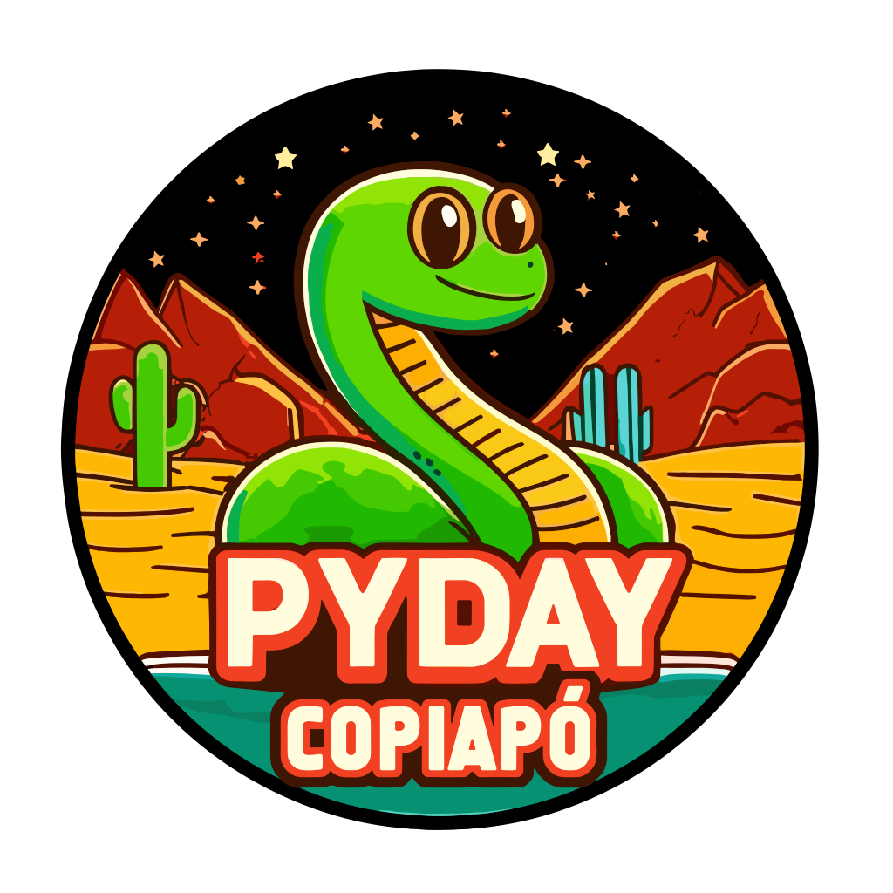
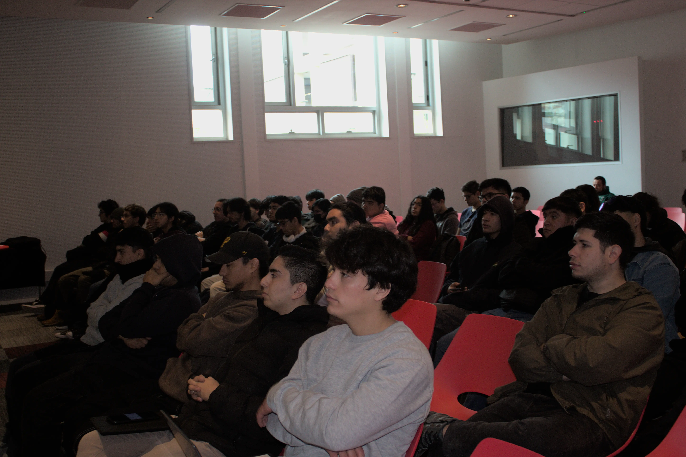
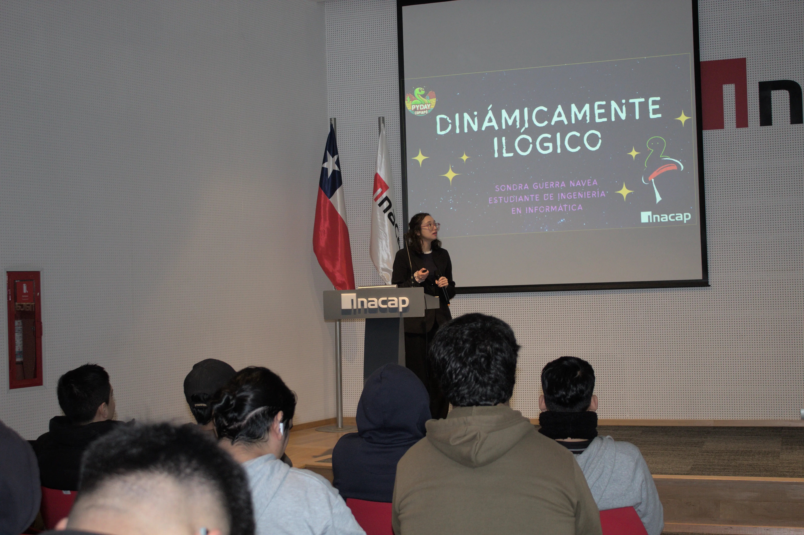
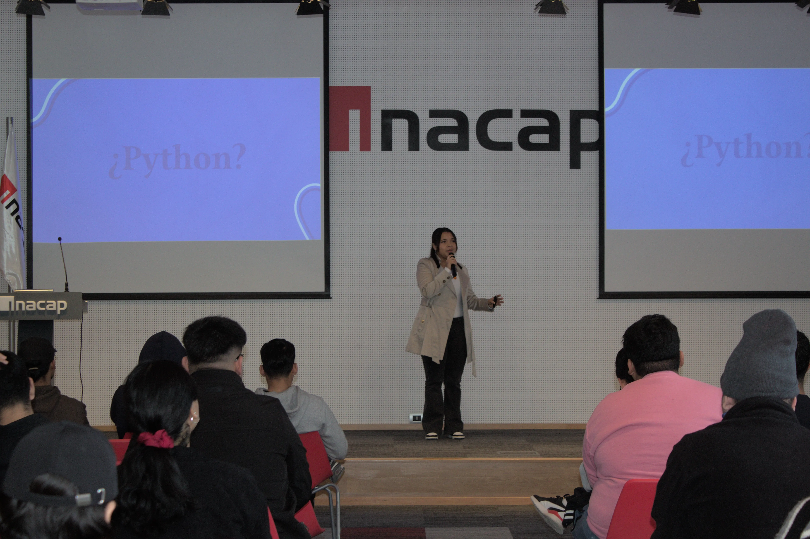
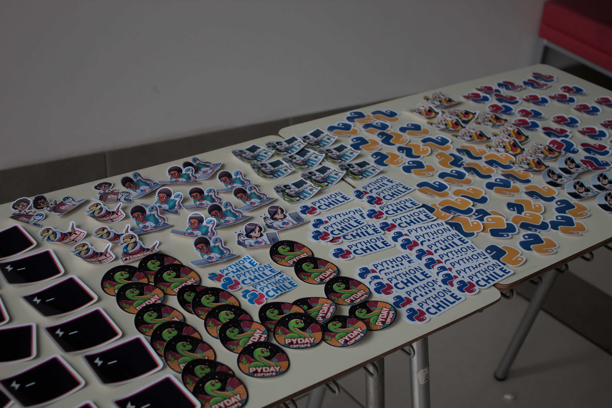
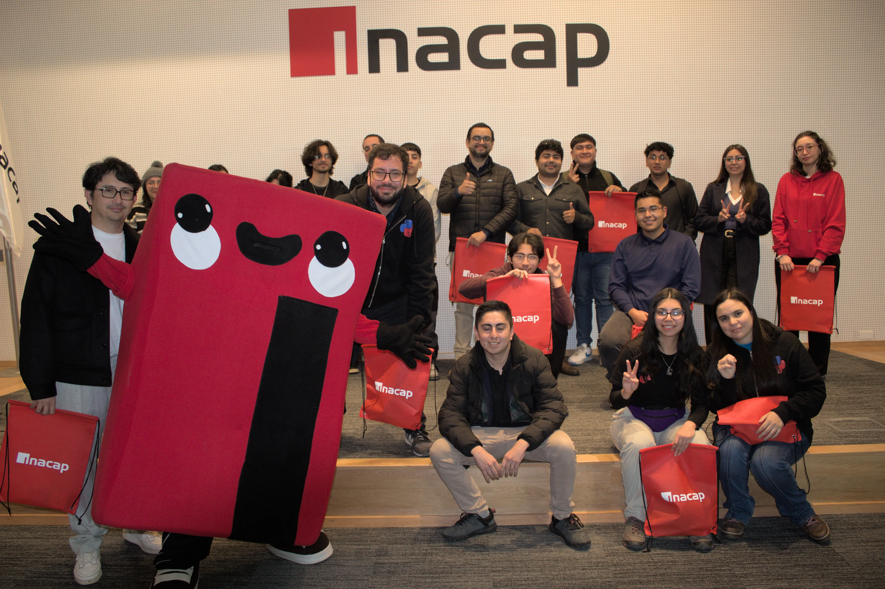
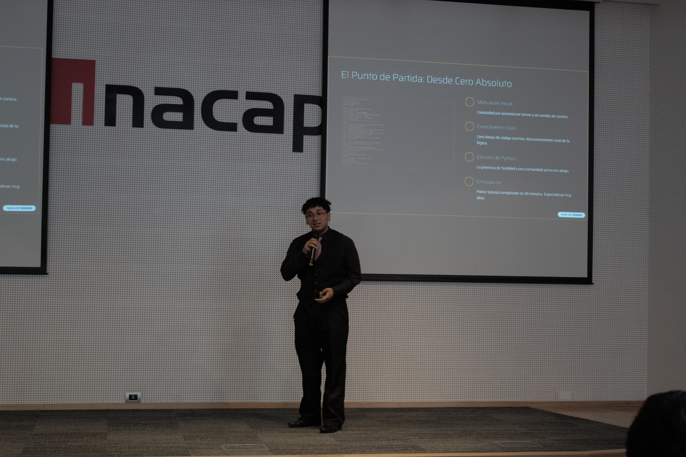

¡Hola, comunidad pythonera! 👋

El pasado **25 de junio de 2025**, vivimos una jornada increíble en **PyDay 2025 Copiapó**, realizada en las instalaciones de [**Inacap sede Copiapó**](https://portales.inacap.cl/sedes/copiapo/). Esta edición fue particularmente especial, no solo por las fascinantes charlas, sino también porque **por primera vez contamos con la presencia de Cristina Verdugo y Liliana Garmendia**, parte del equipo de coordinación de **Python Chile**. 🇨🇱🐍

## 💡 Charlas Destacadas

Durante el evento disfrutamos de una serie de presentaciones que demostraron el enorme potencial de Python en distintos ámbitos tecnológicos:

### 🔧 Microservicio en Python: El Arte de Dividir
Una introducción práctica al diseño de sistemas escalables mediante microservicios. ¡Perfecta para desarrolladores que buscan mejorar la arquitectura de sus proyectos!

### 📡 Monitoreo en Tiempo Real con Python
Exploramos herramientas y técnicas para observar sistemas en vivo usando Python. Ideal para DevOps y entusiastas del backend. ⚙️📊

### 😊 Detección de Emociones con DeepFace y Flask
Una charla fascinante sobre cómo Python y herramientas de visión computacional pueden interpretar emociones humanas en tiempo real. 💬🧠

### 🤖 MCP: Conectando la Inteligencia Artificial con el Mundo Real
Un puente entre hardware y software con IA, mostrando cómo Python permite interactuar con el entorno físico. ¡Tecnología al servicio de la innovación!

### 👁️ Llava: El Futuro de la Visión por Computadora con Python
Un vistazo a **Llava**, un nuevo enfoque en visión por computadora que abre las puertas a nuevas posibilidades en el análisis de imágenes.

🎥 Puedes revivir todas estas charlas en el siguiente enlace:
[🔗 Grabación del evento](https://www.youtube.com/live/jvo6Y0DV514?si=ZtaRosRj3mFBLMXW)

## 🤝 Comunidad, Conexiones y Energía

Además del contenido técnico, **PyDay 2025 Copiapó** fue una gran oportunidad para conocernos, intercambiar ideas y fortalecer la comunidad de Python en el norte de Chile. 💬👥

Cada conversación fue una chispa de inspiración. ¡Gracias a todas las personas que participaron, ya sea como asistentes, speakers o colaboradores!

## 📸 Revive el Evento en Imágenes

Aquí una muestra de los mejores momentos vividos durante la jornada:

## 📚 Recursos y Próximos Eventos

- 🌐 [Página oficial de PyDay](https://pyday.cl)
- 🎞️ [Video completo del evento en YouTube](https://www.youtube.com/live/jvo6Y0DV514?si=ZtaRosRj3mFBLMXW)

Mantente al tanto de nuestras redes y prepárate para el próximo **PyDay**. ¡Seguimos creciendo como comunidad! 🚀🐍

🙌 ¡Nos vemos en la próxima edición!
