En noviembre de 2025 celebramos la **quinta edición de PyCon Chile**, y una vez más tuvimos la oportunidad de reunir a nuestra comunidad para aprender, compartir experiencias y crear nuevas conexiones alrededor de Python.

Esta edición se desarrolló durante dos días y en dos modalidades. El **sábado** **8** **de** **noviembre** nos reunimos presencialmente en **Duoc** **UC,** **sede** **Viña** **del** **Mar**, para disfrutar de una jornada de charlas, talleres y espacios de intercambio. El **domingo 9 de noviembre**, la conferencia continuó de manera **online**, lo que nos permitió ampliar el alcance del evento y conectar con personas que nos acompañaron desde distintos lugares.

Mantener esta combinación entre presencialidad y participación online nos permitió disfrutar de la cercanía que se genera cuando la comunidad se encuentra en un mismo espacio y, al mismo tiempo, continuar acercando el conocimiento a quienes no podían estar físicamente en Viña del Mar.

## 📊 PyCon Chile 2025 en números

Cada número representa personas que decidieron aprender, enseñar, compartir su experiencia o simplemente acercarse un poco más a Python. Durante esta edición contamos con:

* 👥 **Más de 130 asistentes presenciales**  
* 🌎 **Más de 1.000 espectadores online**  
* 🎤 **Más de 9 charlas presenciales**, transmitidas también en vivo  
* 🛠️ **Más de 6 talleres presenciales**  
* 💻 **Más de 13 charlas online**

La participación presencial y el alcance de nuestras transmisiones nos permitieron llevar PyCon Chile mucho más allá de Viña del Mar. Para nosotros, ese es uno de los grandes valores de combinar ambos formatos: crear un punto de encuentro local que, al mismo tiempo, pueda ser disfrutado por una comunidad mucho más amplia.

## 📍 Día 1: nos encontramos en Viña del Mar

El sábado comenzamos temprano en **Duoc UC Viña del Mar**, donde desde las primeras horas del día llegaron asistentes, charlistas y voluntarios. El programa presencial combinó talleres prácticos con charlas para diferentes niveles de experiencia, creando oportunidades tanto para quienes comenzaban con Python como para profesionales que querían profundizar en nuevas herramientas y tecnologías.

Durante los talleres, las personas participantes pudieron trabajar directamente con código y explorar temas como agentes de inteligencia artificial, RAG, Model Context Protocol (MCP), seguridad en aplicaciones con LLM, desarrollo de APIs, datos y fundamentos de programación.

Por la tarde, el auditorio se convirtió en el principal punto de encuentro para una serie de charlas sobre inteligencia artificial, desarrollo web, datos, arquitectura de software y aplicaciones de Python en diversos contextos. Fue una programación diversa que reflejó algo que siempre nos entusiasma de nuestra comunidad: las muchas formas en que Python puede utilizarse para aprender, experimentar y resolver problemas reales.

👉 [**Explora el programa completo de PyCon Chile 2025**](https://pycon.cl/talks/)

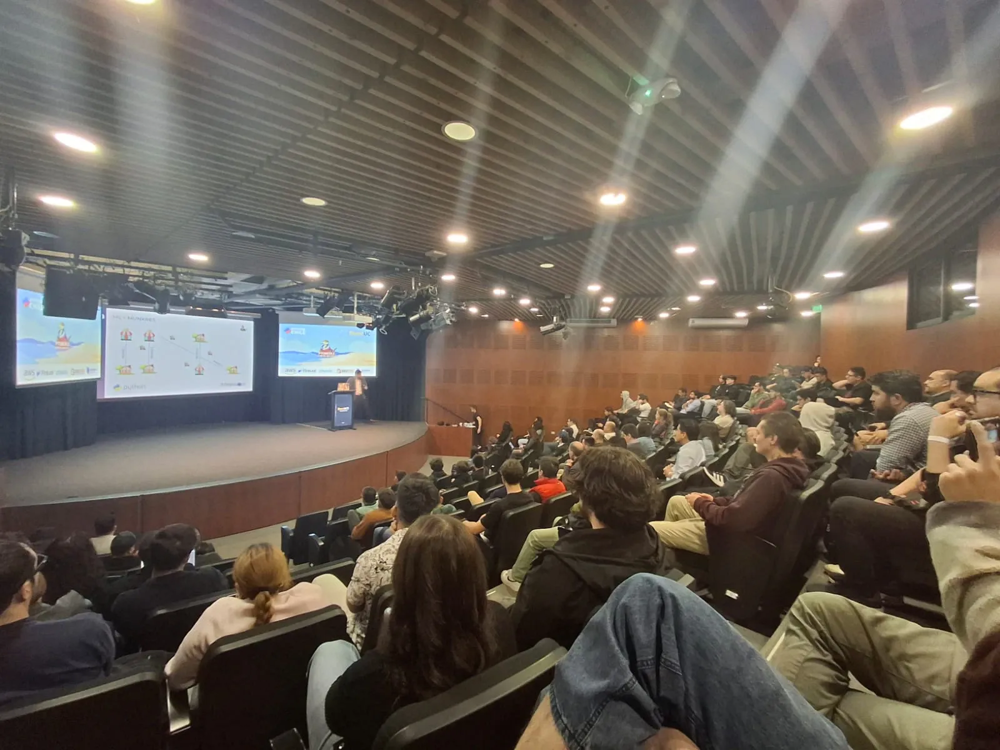

*Charlas, experiencias y proyectos compartidos por integrantes de nuestra comunidad durante la jornada presencial.*

## 🛠️ Aprender haciendo

Los talleres volvieron a ser una parte importante de la experiencia presencial. Más de seis sesiones prácticas permitieron que los asistentes pudieran sentarse frente a sus computadores, escribir código, hacer preguntas y explorar nuevas tecnologías junto a quienes facilitaban cada actividad.

Para una comunidad de programación, estos espacios tienen un valor especial. No se trata solamente de escuchar cómo funciona una herramienta, sino de tener la oportunidad de probarla, equivocarse, preguntar y salir de la sesión con conocimientos que pueden continuar explorándose después de la conferencia.

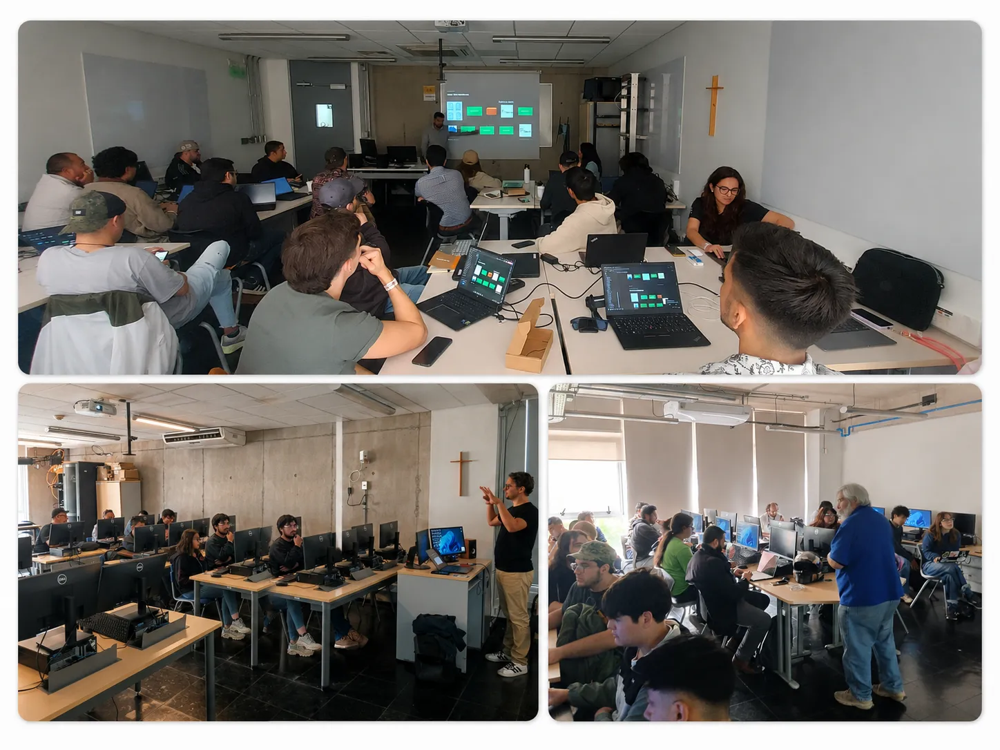

*Los talleres ofrecieron espacios prácticos para aprender, experimentar y compartir conocimiento.*

## ☕ Las conversaciones también son parte de PyCon

Una PyCon no ocurre únicamente en un escenario. Los coffee breaks, el almuerzo y los espacios entre actividades también fueron parte importante de nuestra jornada en Viña del Mar.

Durante el día vimos a personas intercambiando ideas sobre proyectos, conversando con charlistas después de sus presentaciones, reencontrándose con integrantes de otras comunidades y conociéndose por primera vez. También hubo tiempo para fotografías, stickers y esas conversaciones espontáneas que muchas veces terminan convirtiéndose en nuevas colaboraciones.

Queremos que PyCon Chile sea precisamente eso: un espacio donde una persona pueda llegar para aprender algo nuevo y regresar a casa no solo con nuevos conocimientos, sino también habiendo conocido a otras personas con quienes compartir intereses y experiencias.

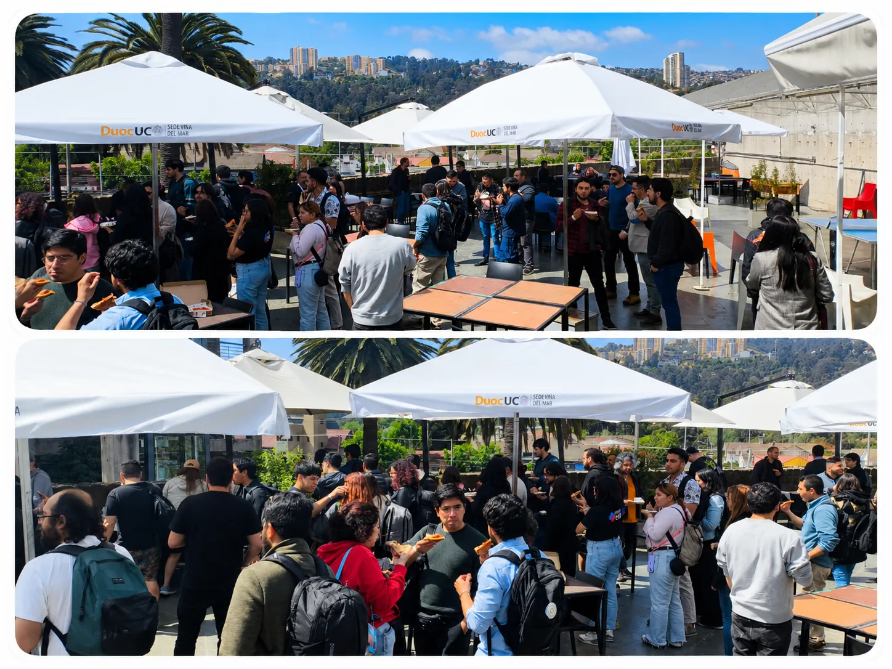

*Las conversaciones entre actividades también son una parte esencial de la experiencia de PyCon.*

## 🌐 Día 2: PyCon Chile continuó online

El domingo 9 de noviembre cambiamos de escenario, pero no de espíritu. PyCon Chile continuó de manera online con **más de 13 charlas**, ampliando la programación y permitiendo que personas desde distintos lugares pudieran participar de la conferencia.

La jornada virtual nos permitió seguir explorando diferentes áreas del ecosistema de Python y, sobre todo, eliminar la distancia como barrera para participar. Sumando las transmisiones de la jornada presencial y la programación online, nuestros contenidos alcanzaron a **más de 1.000 espectadores**.

Para Python Chile, mantener espacios online sigue siendo una forma importante de acercar nuestras actividades a personas que viven fuera de las ciudades donde realizamos nuestros encuentros presenciales y de conectar a nuestra comunidad local con participantes y speakers de otros lugares.

## 🎥 Revive PyCon Chile

Una de las ventajas de transmitir nuestras actividades es que el conocimiento compartido durante la conferencia puede seguir llegando a nuevas personas después del evento.

Si no pudiste acompañarnos durante PyCon Chile 2025 o quieres volver a ver alguna de las presentaciones, puedes encontrar las grabaciones y otros contenidos de nuestros eventos en los canales de Python Chile.

👉 [**Explora el contenido de PyCon Chile 2025 en Youtube**](https://www.youtube.com/live/qCe_SSpnSno?si=HCIOpToaNIlDz-LE)

Esperamos que estos recursos también sean útiles para quienes están aprendiendo Python, buscan material para continuar desarrollando sus habilidades o simplemente quieren descubrir los temas que nuestra comunidad está explorando.

## 🤝 Una conferencia que construimos entre todos

PyCon Chile es un evento comunitario y gratuito, y hacerlo posible requiere meses de organización y la colaboración de muchas personas. Detrás de cada charla, taller, transmisión, coffee break y espacio de encuentro hay voluntarios, charlistas, comunidades, organizaciones y empresas que aportan tiempo, conocimiento y recursos.

En 2025 tuvimos el privilegio de contar con [**AWS**](https://pythonchile.cl/participacion-y-colaboracion-de-aws-en-pycon-chile-2025.html), [**Fintual**](https://pythonchile.cl/participacion-y-colaboracion-de-fintual-en-pycon-chile-2025.html), [**Checkr**](https://pythonchile.cl/participacion-y-colaboracion-de-checkr-en-pycon-chile-2025.html) y [**SoloTodo**](https://pythonchile.cl/participacion-y-colaboracion-de-solotodo-en-pycon-chile-2025.html) como patrocinadores Platinum. Su apoyo, junto con su participación en la conferencia para compartir conocimiento técnico, contribuyó a hacer posible esta edición y a fortalecer el vínculo entre la comunidad y la industria.

También queremos agradecer a todas las empresas y organizaciones que nos acompañaron en los demás niveles de patrocinio y colaboración. El apoyo de organizaciones que creen en las comunidades tecnológicas nos ayuda a mantener estos espacios abiertos y a seguir creando oportunidades para aprender, conectar y compartir conocimiento.

*El apoyo y la participación de empresas y organizaciones contribuyen a que podamos seguir creando espacios abiertos para nuestra comunidad.*

<section class="py-5" id="galeria">
  

    <h2 class="text-center mb-4">📸 Momentos de PyCon Chile 2025</h2>
    

      

        

          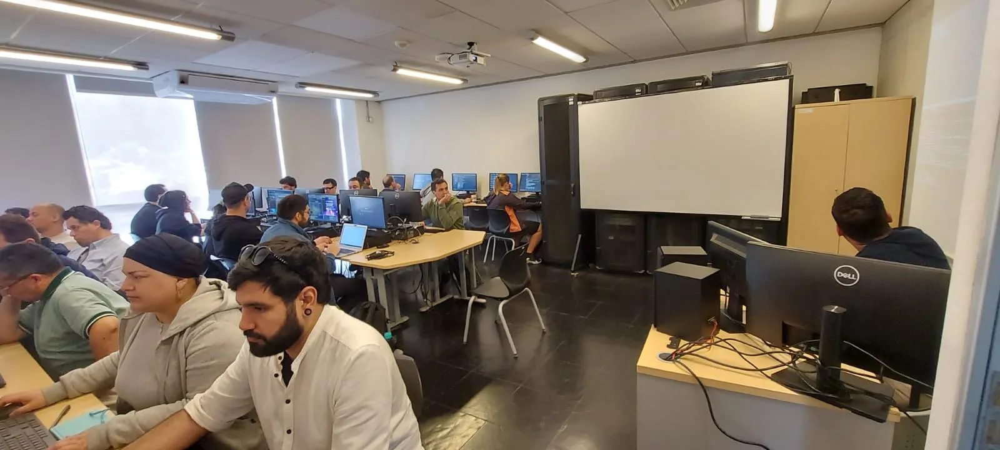
        

        

          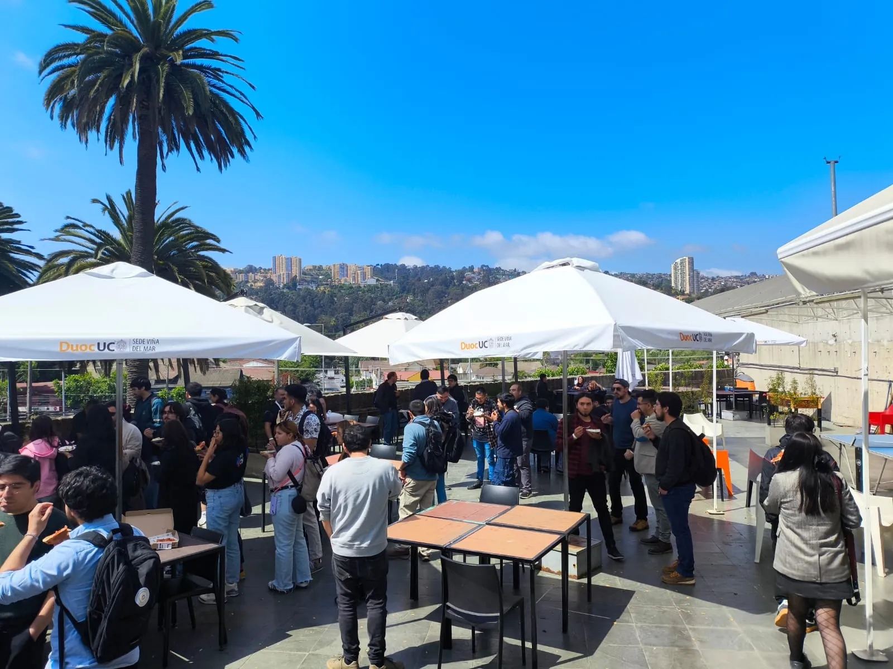
        

        

          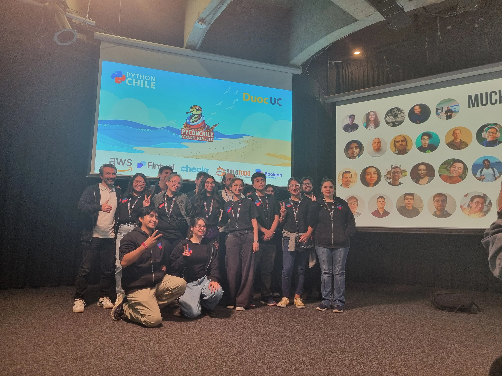
        

        

          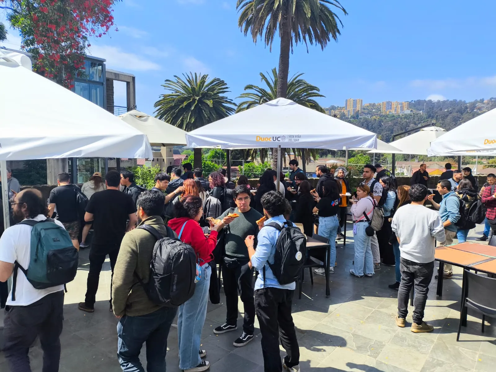
        

        

          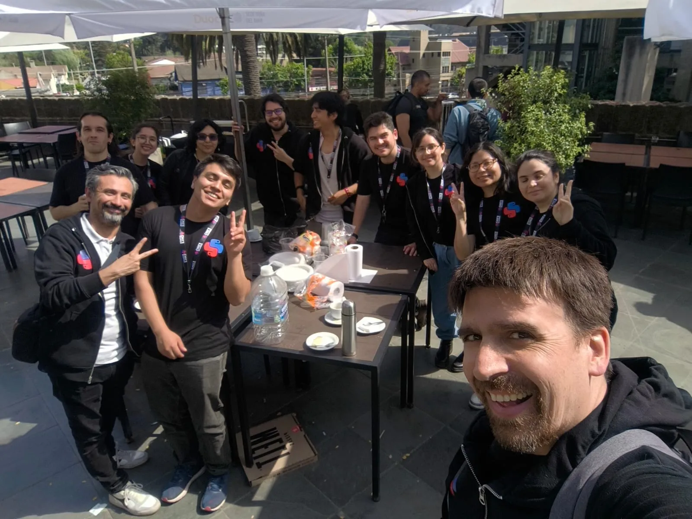
        

        

          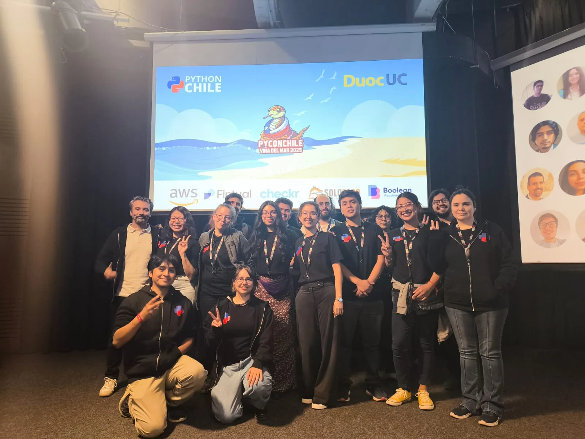
        

        

          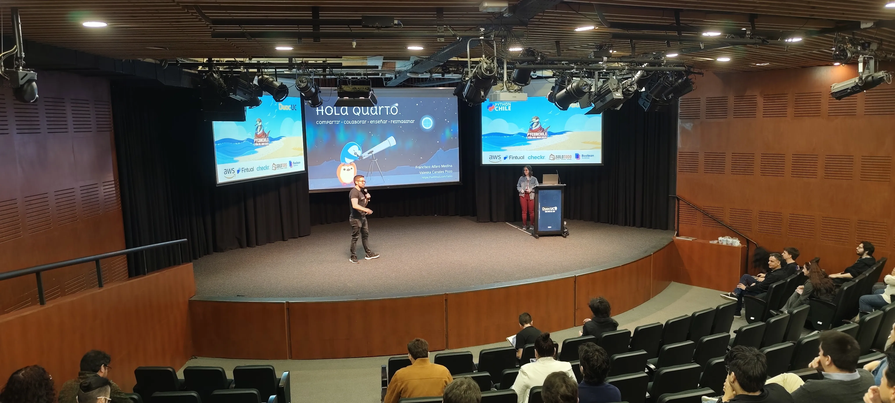
        

        

          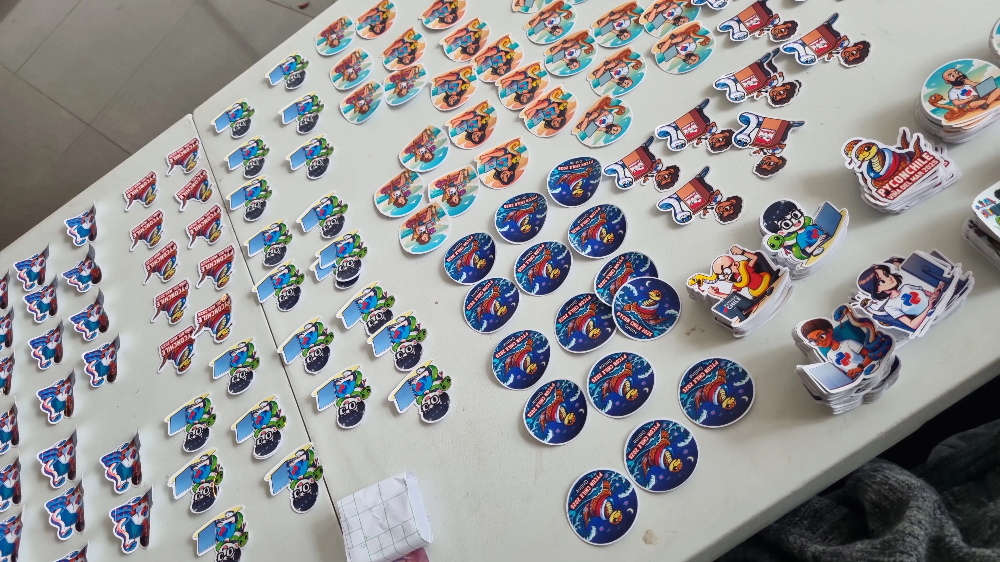
        

        

          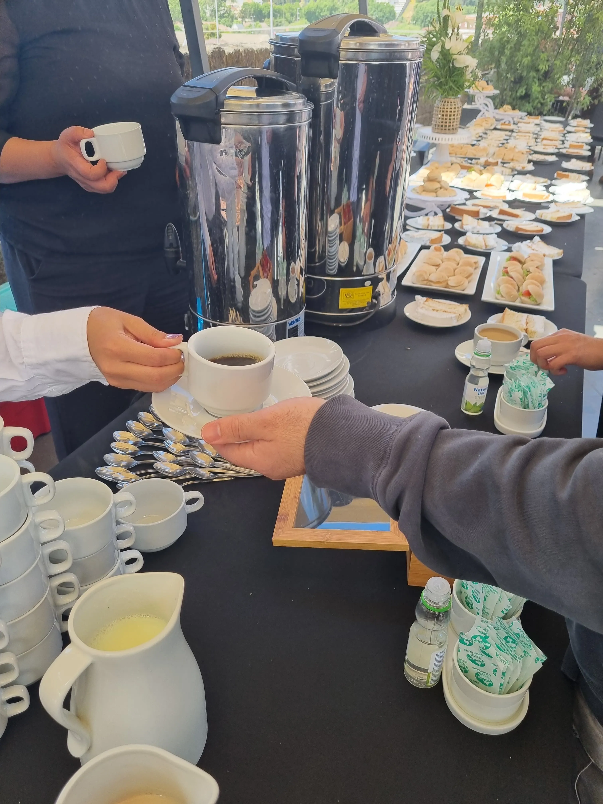
        

        

          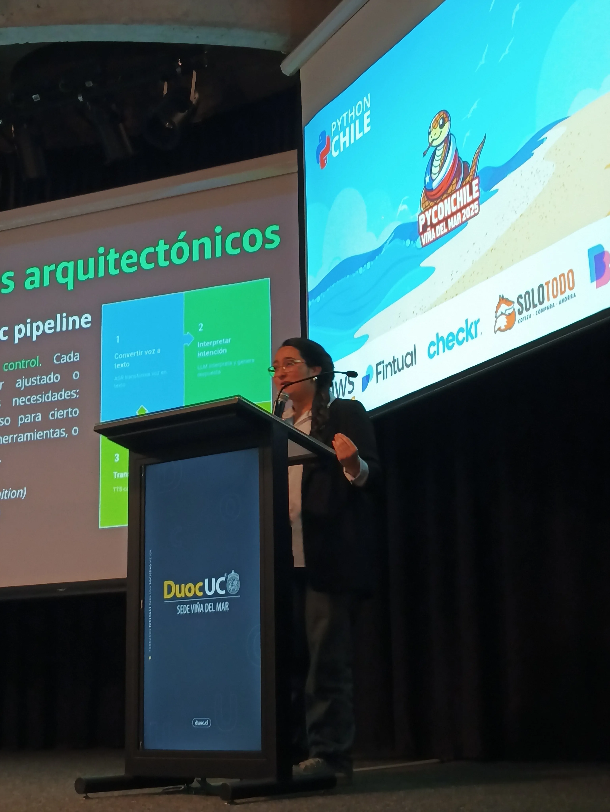
        

        

          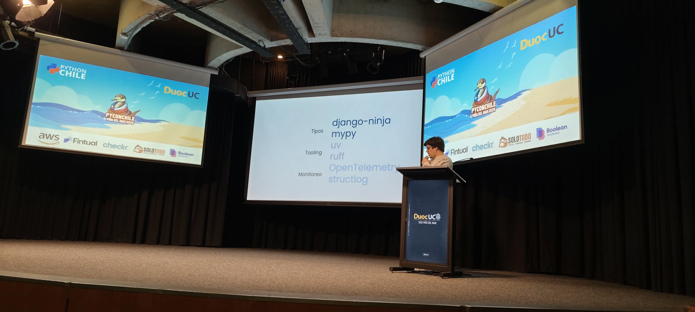
        

      

      <a class="carousel-control-prev" href="#carouselGaleria" role="button" data-slide="prev">
        
        Anterior
      </a>
      <a class="carousel-control-next" href="#carouselGaleria" role="button" data-slide="next">
        
        Siguiente
      </a>
    

  

</section>

## 💛 Gracias por ser parte de PyCon Chile 2025

Queremos agradecer a cada charlista y tallerista que dedicó tiempo a preparar y compartir sus conocimientos; al voluntariado y al equipo organizador que trabajó durante meses para hacer realidad esta edición; a las comunidades que ayudaron a difundir nuestras actividades; y a las empresas y organizaciones que confiaron nuevamente en el trabajo de Python Chile.

Pero, sobre todo, gracias a quienes participaron. A las más de 130 personas que compartieron con nosotros presencialmente en Viña del Mar y a quienes estuvieron detrás de las más de 1.000 visualizaciones online. Sus preguntas, conversaciones, entusiasmo y ganas de seguir aprendiendo son lo que da sentido al trabajo de organizar una conferencia comunitaria.

PyCon Chile 2025 terminó, pero el conocimiento compartido, las nuevas conexiones y las ideas que surgieron durante esos dos días continúan formando parte de nuestra comunidad.

## 🚀 Nos encontramos en 2026

Desde **Python Chile** seguiremos creando espacios para reunir a nuestra comunidad durante 2026 a través de nuestros encuentros, de **PyDay Chile** y de una nueva edición de **PyCon Chile**.

Nuestra comunidad crece gracias a las personas y organizaciones que deciden involucrarse. Ya sea asistiendo a nuestros eventos, proponiendo una charla, colaborando como voluntario, ayudándonos a llegar a nuevas personas o apoyando nuestras iniciativas como organización patrocinadora, hay muchas formas de ser parte de lo que estamos construyendo.

👉 [**Conoce Python Chile y acompáñanos en nuestros próximos eventos**](https://pythonchile.cl/pages/eventos.html)

Gracias por acompañarnos en **PyCon Chile 2025**.

Nos vemos en el próximo encuentro. 🐍💛
