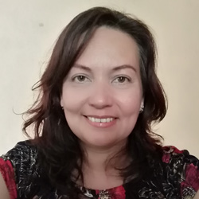

Title: Coordinación
Date: 2020-05-01 10:00

**Python Chile** tiene como objetivo ser el lugar de encuentro de todos los
entusiastas de Python a lo largo del país, fortaleciendo a los miembros de la
comunidad para generar un impacto positivo en el desarrollo de Python a nivel
nacional y mundial.

Las personas que participan en la comunidad son apasionadas por la tecnología
e informática a través de Python, y que buscan compartir conocimiento de forma
libre, pero sobre todo poder fortalecer una comunidad [basada en el
respeto](https://pythonchile.cl/c%C3%B3digo-de-conducta/).

Desde los orígenes de los primeros grupos relacionados a Python en Chile,
variadas iniciativas han existido en distintas regiones e instituciones. Al
momento de unir los grupos que se mantenían vigentes, distintas personas
mostraron interés en poder organizar los pasos de la comunidad para poder
crecer y ser reconocida a nivel país, dichas personas son las que puedes ver
a continuación.

El organización de Python Chile está a cargo de:

* Pablo Lira
* Cristián Vargas
* Carlos Maldonado
* Pamela Bustamante
* Cristián Maureira-Fredes
* Denny Perez
* Elka Buitrago
* Alejandro Weinstein

Sin embargo, existen más personas que actualmente son parte del equipo
de coordinación de la comunidad.

Dentro del equipo, tenemos personas de distintos backgrounds, profesiones,
niveles, y nacionalidades, con lo que si estás interesada en formar parte de
este gran equipo, no dudes en contactarnos en alguna de nuestras plataformas.

> Actualmente la corporación está siendo desarrollada y será la entidad que
> respaldará a la comunidad Python Chile.
>
> La planificación para la admisión de nuevas personas asociadas está aún en
> progreso.

  <!-- entrada persona  -->
  

    

      

        
      

      

        

          <h5 class="mt-4 font-weight-medium mb-0">Carlos Maldonado</h5>
          <h6 class="subtitle mb-2 mt-2">
            <a href="https://www.linkedin.com/in/carlos-maldonado-rivera/"><i class="fab fa-linkedin fa-lg mr-1"></i></a>
          </h6>
          

          Apasionado por la matemáticas aplicadas y la transferencia de conocimiento,
          fundador de Lighthouse Lab consultores en ciencia de datos, y organizador
          de la comunidad Analytics & Python.
          

          

        

      

    
 <!-- end row -->
  
 <!-- end col -->
  <!-- end entrada persona  -->

  <!-- entrada persona  -->
  

    

      

        
      

      

        

          <h5 class="mt-4 font-weight-medium mb-0">Cristián Vargas Busquets</h5>
          <h6 class="subtitle mb-2 mt-2">
            <a href="https://www.linkedin.com/in/cristianvargasbusquets"><i class="fab fa-linkedin fa-lg mr-1"></i></a>
            <a href="https://github.com/cavb"><i class="fab fa-github fa-lg mr-1"></i></a>
            </h6>
          

          Ingeniero de software. Trabajando con robots en InOrbit.ai.
          Anteriormente co-fundador y CTO en Kausana.
          

          

        

      

    
 <!-- end row -->
  
 <!-- end col -->
  <!-- end entrada persona  -->

  <!-- entrada persona  -->
  

    

      

        
      

      

        

          <h5 class="mt-4 font-weight-medium mb-0">Pamela Bustamante</h5>
          <h6 class="subtitle mb-2 mt-2">
            <a href="https://twitter.com/pambusf"><i class="fab fa-twitter fa-lg mr-1"></i></a>
            <a href="https://github.com/pambus"><i class="fab fa-github fa-lg mr-1"></i></a>
            <a href="https://www.linkedin.com/in/pamela-bustamante-faundez/"><i class="fab fa-linkedin fa-lg mr-1"></i></a>
            </h6>
          

          Alumna de Doctorado en Ciencias de la Ingeniería de la Pontificia
          Universidad Católica de Chile. Magíster en Ingeniería Industrial
          e Ingeniera Civil Industrial de la Universidad del Bío-Bío.
          

          

        

      

    
 <!-- end row -->
  
 <!-- end col -->
  <!-- end entrada persona  -->

  <!-- entrada persona  -->
  

    

      

        
      

      

        

          <h5 class="mt-4 font-weight-medium mb-0">Pablo Lira</h5>
          <h6 class="subtitle mb-2 mt-2">
            <a href="https://github.com/pablolirag"><i class="fab fa-github fa-lg mr-1"></i></a>
            </h6>
          

          Analista Programador, apasionado por la programación, maker de
          corazón e iniciador de la comunidad pythonchile.
          

          

        

      

    
 <!-- end row -->
  
 <!-- end col -->
  <!-- end entrada persona  -->

  <!-- entrada persona  -->
  

    

      

        
      

      

        

          <h5 class="mt-4 font-weight-medium mb-0">Cristián Maureira-Fredes</h5>
          <h6 class="subtitle mb-2 mt-2">
            <a href="https://twitter.com/cmaureir"><i class="fab fa-twitter fa-lg mr-1"></i></a>
            <a href="https://github.com/cmaureir"><i class="fab fa-github fa-lg mr-1"></i></a>
            <a href="https://linkedin.com/in/cmaureir"><i class="fab fa-linkedin fa-lg mr-1"></i></a>
          </h6>
          

          Entusiasta Open Source. Mantenedor de Qt for Python y Líder de
          Proyecto en
          The Qt Company. Doctor en Astrofísica del Max-Planck-Institut für
          Gravitationsphysik (Alemania) y Máster en Ingenieria en Informática
          en la UTFSM (Chile)
          

          

        

      

    
 <!-- end row -->
  
 <!-- end col -->
  <!-- end entrada persona  -->

  <!-- entrada persona  -->
  

    

      

        
      

      

        

          <h5 class="mt-4 font-weight-medium mb-0">Cris Hernández</h5>
          <h6 class="subtitle mb-2 mt-2">
            <a href="https://twitter.com/crishernandezco"><i class="fab fa-twitter fa-lg mr-1"></i></a>
            <a href="https://www.linkedin.com/in/crishernandezco"><i class="fab fa-linkedin fa-lg mr-1"></i></a>
          </h6>
          

          Fundador y CEO de Mapoteca, Startup dedicada a la generación de
          soluciones de inteligencia territorial para clientes a nivel global.
          Cris es experto en ciencia de datos espaciales y visualización de
          datos.
          

          

        

      

    
 <!-- end row -->
  
 <!-- end col -->
  <!-- end entrada persona  -->

  <!-- entrada persona  -->
  

    

      

        
      

      

        

          <h5 class="mt-4 font-weight-medium mb-0">Alejandro Weinstein</h5>
          <h6 class="subtitle mb-2 mt-2">
            <a href="https://github.com/aweinstein"><i class="fab fa-github fa-lg mr-1"></i></a>
            <a href="https://twitter.com/ajweinstein"><i class="fab fa-twitter fa-lg mr-1"></i></a>
          </h6>
          

          Profesor de la Escuela de Ingeniería Biomédica y director del FabLab de la Universidad de Valparaíso.
          

          

        

      

    
 <!-- end row -->
  
 <!-- end col -->
  <!-- end entrada persona  -->

  <!-- entrada persona  -->
  

    

      

        
      

      

        

          <h5 class="mt-4 font-weight-medium mb-0">Elka Buitrago</h5>
          <h6 class="subtitle mb-2 mt-2">
            <a href="https://twitter.com/elkabuitrago"><i class="fab fa-twitter fa-lg mr-1"></i></a>
            <a href="https://www.linkedin.com/in/elka-buitrago"><i class="fab fa-linkedin fa-lg mr-1"></i></a>
          </h6>
          

             Aprendiz de Python. Fan del análisis de datos
          

          

        

      

    
 <!-- end row -->
  
 <!-- end col -->
  <!-- end entrada persona  -->

  <!-- entrada persona  -->
  

    

      

        
      

      

        

          <h5 class="mt-4 font-weight-medium mb-0">Denny Perez</h5>
          <h6 class="subtitle mb-2 mt-2">
            <a href="https://twitter.com/dennyperez18"><i class="fab fa-twitter fa-lg mr-1"></i></a>
            <a href="https://www.linkedin.com/in/dennyperez18"><i class="fab fa-linkedin fa-lg mr-1"></i></a>
          </h6>
          

          Analista QA. Entusiasta de la comunidad Python. Coorganizadora de las
          comunidades PyLadies Chile y PyConLatam.
          

          

        

      

    
 <!-- end row -->
  
 <!-- end col -->
  <!-- end entrada persona  -->

  <!-- entrada persona  -->
  

    

      

        
      

      

        

          <h5 class="mt-4 font-weight-medium mb-0">Franklin Arredondo</h5>
          <h6 class="subtitle mb-2 mt-2">
            <a href="https://github.com/farreusa"><i class="fab fa-github fa-lg mr-1"></i></a>
            <a href="https://www.linkedin.com/in/fearredondo/"><i class="fab fa-linkedin fa-lg mr-1"></i></a>
          </h6>
          

            Ingeniero en Mantenimiento Mecánico, Magíster en Administración de Empresas.
            Entusiasta, apasionado y dedicado a la ciencia de datos.
          

          

        

      

    
 <!-- end row -->
  
 <!-- end col -->
  <!-- end entrada persona  -->

  <!-- entrada persona  -->
  

    

      

        
      

      

        

          <h5 class="mt-4 font-weight-medium mb-0">Mario Hevia</h5>
          <h6 class="subtitle mb-2 mt-2">
            <a href="https://github.com/marioymario"><i class="fab fa-github fa-lg mr-1"></i></a>
            <a href="https://www.linkedin.com/in/marioheviadata/"><i class="fab fa-twitter fa-lg mr-1"></i></a>
          </h6>
          

          Cientifico de Datos, Capturador sonidos de pajaros, estudiante de Vajrayana.
          

          

        

      

    
 <!-- end row -->
  
 <!-- end col -->
  <!-- end entrada persona  -->

  <!-- entrada persona  -->
  

    

      

        
      

      

        

          <h5 class="mt-4 font-weight-medium mb-0">Jhoselyn Pajuelo Villanueva</h5>
          <h6 class="subtitle mb-2 mt-2">
            <a href="https://github.com/miluskapajuelo"><i class="fab fa-github fa-lg mr-1"></i></a>
            <a href="https://www.linkedin.com/in/jhoselynpajuelovillanueva"><i class="fab fa-linkedin fa-lg mr-1"></i></a>
          </h6>
          

          Ingeniera industrial y estudiante de desarrollo de software, amante del código y la gestión de proyectos, con experiencia liderando equipos.
          

          

        

      

    
 <!-- end row -->
  
 <!-- end col -->
  <!-- end entrada persona  -->

 <!-- end row -->
